# PaperQA Discovery Architecture

## Overview

PaperQA Discovery is a web-based interface for the PaperQA2 scientific paper question-answering system. It provides an intuitive way to query scientific literature using natural language questions, with support for both local document collections and public domain searches.

## Current Implementation Status

### ✅ Working Features
- **Cloud LLM Processing**: Using OpenRouter.ai with GLM-4.5-Air model
- **Local Embeddings**: Using Ollama with nomic-embed-text model
- **Public Domain Search**: Search external scientific databases (when API keys configured)
- **Web Interface**: React frontend with FastAPI backend
- **Document Management**: Upload, list, and delete papers
- **Enhanced API Documentation**: Comprehensive Swagger UI with detailed schemas
- **Health Monitoring**: System status and environment validation

### ⚠️ Current Limitations
- **No Local Papers**: `uploaded_papers` directory has been deleted
- **External API Keys**: Required for full public domain search functionality
- **Rate Limits**: OpenRouter.ai free tier has rate limits

### 🔧 Current Configuration

**LLM Provider**: OpenRouter.ai
- **Primary Model**: `z-ai/glm-4.5-air:free`
- **Alternative**: `google/gemma-3n-e2b-it:free` (commented out)
- **Embeddings**: Ollama `nomic-embed-text:latest`

**Environment Variables**:
```bash
OPENROUTER_API_KEY="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"
```

## System Architecture

### High-Level System Flow

```mermaid
graph TB
    A[User Query] --> B[Frontend React App]
    B --> C[FastAPI Backend]
    C --> D{Query Source Type}
    
    D -->|Local| E[Local Document Search]
    D -->|Public| F[External Paper Search]
    D -->|All| G[Combined Search]
    
    E --> H[PaperQA Direct Query]
    F --> I[PaperQA Direct Query]
    G --> J[PaperQA Direct Query]
    
    H --> K[OpenRouter.ai LLM]
    I --> K
    J --> K
    
    K --> L[Formatted Answer]
    L --> M[Evidence & Sources]
    M --> N[Response to User]
    
    subgraph "Cloud Infrastructure"
        O[OpenRouter.ai API]
        P[GLM-4.5-Air Model]
    end
    
    K --> O
    O --> P
    
    subgraph "Local Infrastructure"
        Q[Ollama Server]
        R[Embedding Model: nomic-embed-text]
    end
    
    H --> Q
    Q --> R
    
    subgraph "External APIs (Optional)"
        S[Semantic Scholar]
        T[Crossref]
        U[Other Scientific DBs]
    end
    
    I --> S
    I --> T
    I --> U
    
    style O fill:#ff9999
    style Q fill:#99ccff
    style S fill:#99ff99
```



### Current Query Processing Flow

```mermaid
graph TD
    A[User Question] --> B[Source Selection]
    B --> C{Source Type}
    
    C -->|Local| D[Check Local Papers]
    C -->|Public| E[External Search Only]
    C -->|All| F[Combined Search]
    
    D --> G{Local Papers Available?}
    G -->|No| H[Return "No Papers Loaded"]
    G -->|Yes| I[Vector Search in Local Index]
    
    E --> J[PaperQA Direct Query]
    F --> K[PaperQA Direct Query]
    I --> L[PaperQA Direct Query]
    
    J --> M[OpenRouter.ai Processing]
    K --> M
    L --> M
    
    M --> N[Answer Generation]
    N --> O[Evidence Extraction]
    O --> P[Response Formatting]
    
    subgraph "Current State"
        Q[No Uploaded Papers]
        R[OpenRouter.ai LLM]
        S[Ollama Embeddings]
    end
    
    G --> Q
    M --> R
    I --> S
    
    style Q fill:#ffcccc
    style R fill:#ccffcc
    style S fill:#ccccff
```

### Data Flow Architecture


## Functional Requirements Level

### Core Components

#### 1. Current Query Processing Pipeline


#### 2. Current Agent System


#### 3. Current Tool System

```mermaid
graph TB
    A[Query Input] --> B[Direct PaperQA Query]
    B --> C[Settings Application]
    C --> D[LLM Processing]
    
    D --> E[OpenRouter.ai API]
    E --> F[Model Response]
    F --> G[Answer Synthesis]
    
    subgraph "Current State"
        H[No Agent Tools]
        I[Direct aquery() Method]
        J[Simplified Processing]
    end
    
    B --> H
    B --> I
    B --> J
    
    style H fill:#ffcccc
    style I fill:#ccffcc
    style J fill:#ccccff
```

## User Requirements Level

### Current User Journey Flow


### Current User Interface Architecture


### Current API Architecture

```mermaid
graph LR
    A[Frontend React] --> B[FastAPI Backend]
    B --> C[PaperQA Core]
    C --> D[OpenRouter.ai LLM]
    C --> E[Ollama Embeddings]
    C --> F[External APIs]
    
    subgraph "API Endpoints"
        G[/api/query]
        H[/api/papers]
        I[/api/upload]
        J[/api/load-papers]
        K[/health]
    end
    
    A --> G
    A --> H
    A --> I
    A --> J
    A --> K
    
    subgraph "External Services"
        L[OpenRouter.ai]
        M[Ollama Server]
        N[Semantic Scholar]
        O[Crossref]
    end
    
    D --> L
    E --> M
    F --> N
    F --> O
    
    style L fill:#ccffcc
    style M fill:#ccccff
    style N fill:#99ff99
    style O fill:#99ff99
```

## Technical Implementation Details

### Current Model Configuration

```mermaid
graph TD
    A[Settings Configuration] --> B[LLM Models]
    A --> C[Embedding Models]
    A --> D[Query Processing]
    
    B --> E[OpenRouter.ai GLM-4.5-Air]
    B --> F[Summary LLM - Same]
    B --> G[Agent LLM - Same]
    
    C --> H[Ollama nomic-embed-text]
    
    D --> I[Direct aquery() Method]
    D --> J[No Agent Tools]
    D --> K[Simplified Processing]
    
    subgraph "Current Setup"
        L[Cloud LLM]
        M[Local Embeddings]
        N[No Local Papers]
    end
    
    E --> L
    H --> M
    I --> N
    
    style L fill:#ccffcc
    style M fill:#ccccff
    style N fill:#ffcccc
```

### Current Search Strategy Flow

```mermaid
graph TD
    A[Query Input] --> B[Source Analysis]
    B --> C{Source Type}
    
    C -->|Local| D[Check Local Papers]
    C -->|Public| E[External Search]
    C -->|All| F[Combined Search]
    
    D --> G{Local Papers Available?}
    G -->|No| H[Return "No Papers"]
    G -->|Yes| I[Local Vector Search]
    
    E --> J[PaperQA Direct Query]
    F --> K[PaperQA Direct Query]
    I --> L[PaperQA Direct Query]
    
    J --> M[OpenRouter.ai Processing]
    K --> M
    L --> M
    
    M --> N[Answer Generation]
    N --> O[Evidence Processing]
    O --> P[Response Formatting]
    
    subgraph "Current State"
        Q[No Local Papers]
        R[OpenRouter.ai Active]
        S[Public Search Works]
    end
    
    G --> Q
    M --> R
    E --> S
    
    style Q fill:#ffcccc
    style R fill:#ccffcc
    style S fill:#ccffcc
```

## Current Implementation Details

### Source Type Behavior

| Source Type | Current Behavior | Status |
|-------------|------------------|--------|
| **Local** | ❌ No papers available | `uploaded_papers` deleted |
| **Public** | ✅ Works with external APIs | Requires API keys for full functionality |
| **All** | ⚠️ Limited to public search | No local papers to combine |

### Current Configuration

```python
# Current LLM Configuration
settings = Settings(
    llm="openrouter/z-ai/glm-4.5-air:free",
    summary_llm="openrouter/z-ai/glm-4.5-air:free", 
    embedding="ollama/nomic-embed-text:latest",
    verbosity=1,  # Reduced to avoid debug noise
)

# Current Query Processing
result = await query_docs.aquery(query.query, settings=settings)
```

### External API Integration


## Key Features

### 1. Current Multi-Source Search
- **Local Papers**: ❌ No papers available (directory deleted)
- **Public Domain**: ✅ Works with external scientific databases
- **All Sources**: ⚠️ Limited to public search only

### 2. Current Processing System
- **OpenRouter.ai LLM**: Cloud-based text generation ✅
- **Ollama Embeddings**: Local embedding generation ✅
- **Direct Query Processing**: Simplified PaperQA integration ✅
- **Enhanced Logging**: Clean output without debug noise ✅

### 3. Current Document Processing
- **No Local Documents**: `uploaded_papers` directory deleted
- **External Search**: Available when API keys configured
- **Upload Capability**: Ready for new papers

### 4. Current AI Processing
- **OpenRouter.ai Integration**: Cloud LLM processing ✅
- **Local Embeddings**: Privacy-preserving embedding generation ✅
- **Real-time Processing**: Fast query response times ✅

## Performance Considerations

### Current Scalability
- **Cloud LLM**: Scalable processing via OpenRouter.ai ✅
- **Local Embeddings**: Efficient local embedding generation ✅
- **API Rate Limits**: OpenRouter.ai free tier limitations ⚠️

### Current Reliability
- **Error Handling**: Graceful degradation for API failures ✅
- **Fallback Strategies**: Clear error messages ✅
- **Data Validation**: Input validation and sanitization ✅

### Current Security
- **Cloud Processing**: Data sent to OpenRouter.ai for LLM processing
- **Local Embeddings**: Embedding generation stays local ✅
- **Input Sanitization**: Protection against malicious inputs ✅

## Immediate Actions Needed

### 1. Restore Local Papers (Optional)
```bash
# Create new papers directory
mkdir uploaded_papers

# Upload some sample papers for testing
# Use the web interface or API endpoints
```

### 2. Configure External APIs (Optional)
```bash
# Set environment variables for full public search
export SEMANTIC_SCHOLAR_API_KEY="your-key"
export CROSSREF_API_KEY="your-key"
```

### 3. Current System Status
- ✅ **Backend**: Running with OpenRouter.ai + Ollama
- ✅ **Frontend**: React app with clean interface
- ✅ **API Documentation**: Enhanced Swagger UI
- ✅ **Health Monitoring**: System status available
- ❌ **Local Papers**: No papers available
- ⚠️ **Public Search**: Limited without API keys

## Future Enhancements

### Planned Features
- **Paper Upload**: Restore local paper functionality
- **Advanced Filtering**: Date ranges, authors, journals
- **Export Capabilities**: Multiple output formats
- **API Integration**: Additional scientific databases

### Current System Ready For
- **Public Domain Queries**: When API keys configured
- **Paper Uploads**: Ready to accept new papers
- **Enhanced Queries**: Full PaperQA functionality
- **System Monitoring**: Health checks and validation 