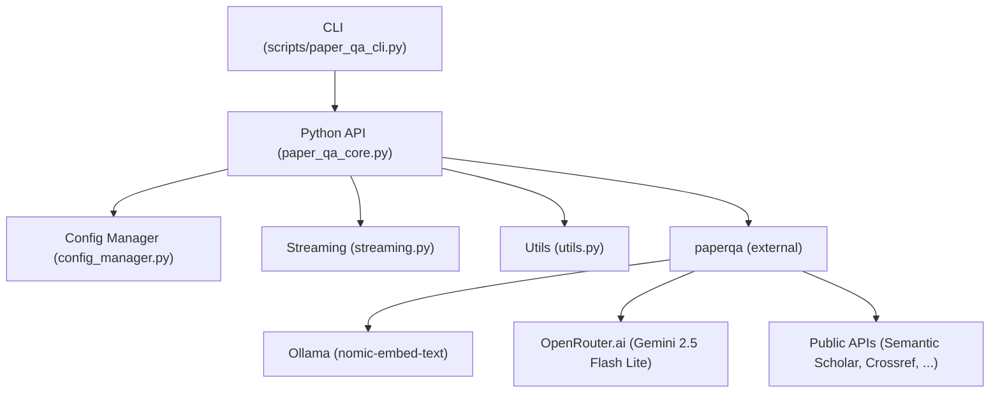

# Developer Notes: Paper-QA

## 1. Traceability Matrix

| User Requirement | Functional Requirement | Implementation |
|------------------|----------------------|----------------|
| Query local PDFs | System must load and index user PDFs | `PaperQACore.query_local_papers`, `configs/local_only.json` |
| Query public sources | System must search public APIs (Semantic Scholar, Crossref, etc) | `PaperQACore.query_public_sources`, `configs/public_only.json` |
| Combined research | System must merge local and public results | `PaperQACore.query_combined`, `configs/combined.json` |
| Citations in answers | All answers must include citations | Core logic in `paperqa` and streaming callbacks |
| Streaming responses | Show answers as they generate | `streaming.py`, CLI callbacks |
| Configurable models | User can select LLM/embedding | `configs/*.json`, `config_manager.py` |
| CLI and API | Both CLI and Python API must be available | `scripts/paper_qa_cli.py`, `paper_qa_core.py` |
| Error handling | System must retry and report errors | `tenacity` usage, error returns |

---

## 2. Architecture Overview

- **CLI**: User entry point, parses args, calls API.
- **API**: Main logic, exposes query functions, manages config and streaming.
- **Config Manager**: Loads/validates configs, supports overrides.
- **Streaming**: Handles real-time output, supports multiple callbacks.
- **Utils**: Helpers for file ops, status, formatting.
- **paperqa**: External RAG engine, handles LLM/embedding, citations.
- **Ollama/OpenRouter/Public**: External services.

---

## 3. Key Files & Structure

- `src/paper_qa_core.py`: Main API, all query logic.
- `src/config_manager.py`: Config loading/validation.
- `src/streaming.py`: Streaming/callbacks.
- `src/utils.py`: Helpers.
- `configs/`: All scenario configs (local_only, public_only, combined, etc).
- `scripts/paper_qa_cli.py`: CLI entry point.
- `tests/`: All tests.

---

## 4. Testing & Linting

- Run all tests: `make test`
- Lint: `make lint`
- Pytest: `make pytest`
- Add new tests in `tests/` for all new features.

---

## 5. Contribution Guidelines

- Fork, branch, PR.
- All new features must have tests.
- Keep user-facing docs in `README.md` only.
- Keep dev/traceability/architecture here.

---

## 6. Advanced Topics

- **Config overrides**: Use `ConfigManager` to load/merge configs.
- **Streaming**: Use `create_multi_callback` for custom output.
- **Error handling**: All query functions return structured errors; retry logic via `tenacity`.

---

## 7. References
- [Paper-QA](https://github.com/Future-House/paper-qa)
- [OpenRouter.ai](https://openrouter.ai/)
- [Ollama](https://ollama.com/)