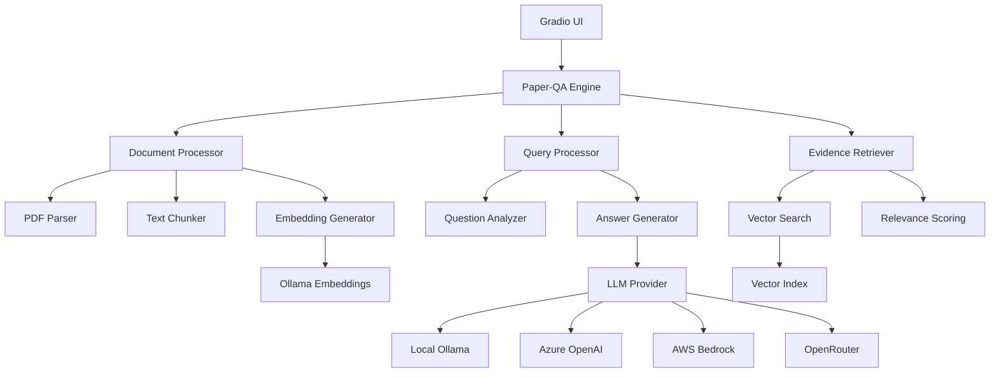
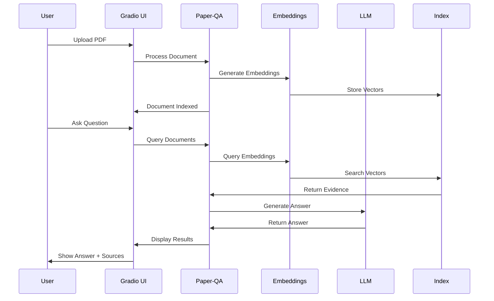
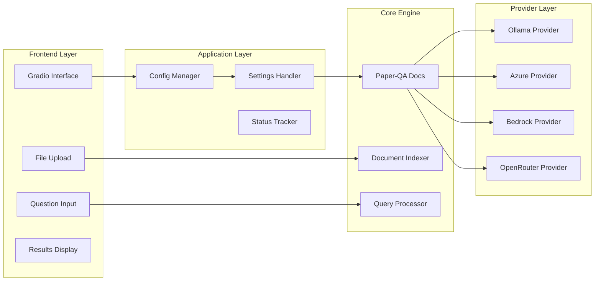
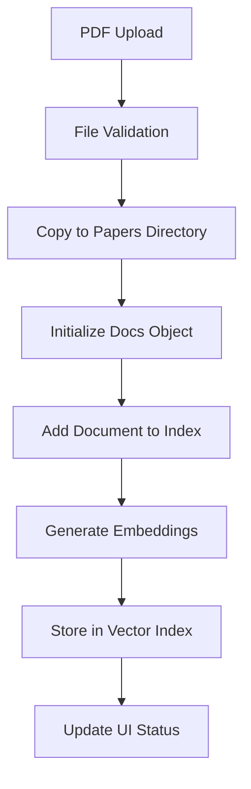
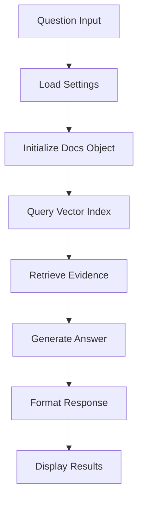

# Developer Documentation

## Architecture Overview

### System Architecture



### Data Flow



### Component Architecture



## Technical Implementation

### Core Components

#### 1. Gradio UI (`src/paperqa2_ui.py`)
- **Purpose**: Web interface for document upload and question answering
- **Key Functions**:
  - `process_uploaded_files_async()`: Handle file uploads and indexing
  - `process_question_async()`: Process questions and generate answers
  - `initialize_settings()`: Load and configure Paper-QA settings

#### 2. Configuration Manager (`src/config_manager.py`)
- **Purpose**: Manage different LLM/embedding configurations
- **Key Functions**:
  - `load_config()`: Load JSON configuration files
  - `get_settings()`: Convert config to Paper-QA Settings object
  - `list_configs()`: List available configurations

#### 3. Paper-QA Integration
- **Docs Object**: Main interface for document processing and querying
- **Settings Object**: Configuration for LLM, embeddings, and processing parameters
- **Async Operations**: All document and query operations are asynchronous

### Configuration System

#### Configuration Structure
```json
{
  "llm": "provider/model",
  "embedding": "provider/model",
  "llm_config": {
    "api_key": "${ENV_VAR}",
    "api_base": "endpoint_url"
  },
  "embedding_config": {
    "api_base": "endpoint_url"
  },
  "answer": {
    "evidence_k": 20,
    "answer_max_sources": 7
  }
}
```

#### Environment Variables
- `AZURE_OPENAI_API_KEY`: Azure OpenAI API key
- `AZURE_OPENAI_ENDPOINT`: Azure OpenAI endpoint URL
- `AWS_ACCESS_KEY_ID`: AWS access key
- `AWS_SECRET_ACCESS_KEY`: AWS secret key
- `AWS_REGION`: AWS region
- `OPENROUTER_API_KEY`: OpenRouter API key

### File Processing Pipeline



### Query Processing Pipeline



## Development Setup

### Prerequisites
```bash
# Install Python 3.11+
# Install Ollama
# Install uv package manager
```

### Local Development
```bash
# Clone repository
git clone <repository-url>
cd paper-qa-ui

# Setup environment
make setup

# Start development server
make ui

# Run tests
make test-ui-functionality
make test-file-upload
```

### Testing
```bash
# Test UI functionality
make test-ui-functionality

# Test file upload
make test-file-upload

# Test complete workflow
make test-complete-workflow

# Test CLI
make test-cli
```

## Debugging

### Common Issues

#### 1. File Upload Errors
```python
# Check Gradio file object handling
if hasattr(file_obj, 'name'):
    source_path = Path(file_obj.name)
else:
    source_path = Path(file_obj)
```

#### 2. Configuration Loading
```python
# Verify configuration loading
config_manager = ConfigManager()
config_dict = config_manager.load_config("config_name")
settings = Settings(**config_dict)
```

#### 3. Ollama Connection
```bash
# Check Ollama status
ollama list
ollama serve

# Test connection
curl http://localhost:11434/api/tags
```

#### 4. Port Conflicts
```bash
# Kill existing processes
make kill-server

# Check port usage
lsof -i :7860
```

### Logging
```python
import logging
logging.basicConfig(level=logging.INFO)
logging.getLogger("paperqa").setLevel(logging.INFO)
logging.getLogger("litellm").setLevel(logging.WARNING)
```

### Debug Tools
```bash
# Test specific components
python scripts/test_ui_simple.py
python scripts/test_optimized_config.py

# Check environment
make check-env
```

## Code Structure

### Key Files
- `src/paperqa2_ui.py`: Main Gradio UI application
- `src/config_manager.py`: Configuration management
- `configs/*.json`: Configuration profiles
- `scripts/test_*.py`: Test scripts
- `Makefile`: Build and management commands

### Configuration Files
- `optimized_ollama.json`: Local processing (default)
- `azure_openai.json`: Azure OpenAI integration
- `amazon_bedrock.json`: AWS Bedrock integration
- `openrouter_ollama.json`: OpenRouter integration

### Test Files
- `test_ui_functionality.py`: UI accessibility testing
- `test_file_upload.py`: File upload testing
- `test_complete_workflow.py`: End-to-end testing
- `test_optimized_config.py`: Configuration testing

## Performance Optimization

### Local Processing
- Use Ollama for both LLM and embeddings
- Optimize chunk size and overlap settings
- Configure evidence retrieval parameters

### Cloud Processing
- Use local embeddings with cloud LLMs
- Configure API timeouts and retries
- Monitor API usage and costs

### Memory Management
- Process documents in batches
- Clean up temporary resources
- Monitor memory usage during indexing

## Security Considerations

### Local Processing
- No data leaves local machine
- Secure API key management
- Input validation for uploaded files

### Cloud Processing
- Secure API key storage
- Network security for API calls
- Data privacy compliance

## Deployment

### Local Deployment
```bash
make ui
# Access at http://localhost:7860
```

### Production Considerations
- Resource requirements (RAM, CPU)
- Storage for documents and indexes
- Network access for cloud providers
- Security and access control

## Contributing

### Development Workflow
1. Fork repository
2. Create feature branch
3. Make changes
4. Run tests
5. Submit pull request

### Code Standards
- Follow Python PEP 8
- Add type hints
- Include docstrings
- Write tests for new features

### Testing Requirements
- All new features must have tests
- UI functionality must be tested
- Configuration changes must be validated
- Performance impact must be assessed