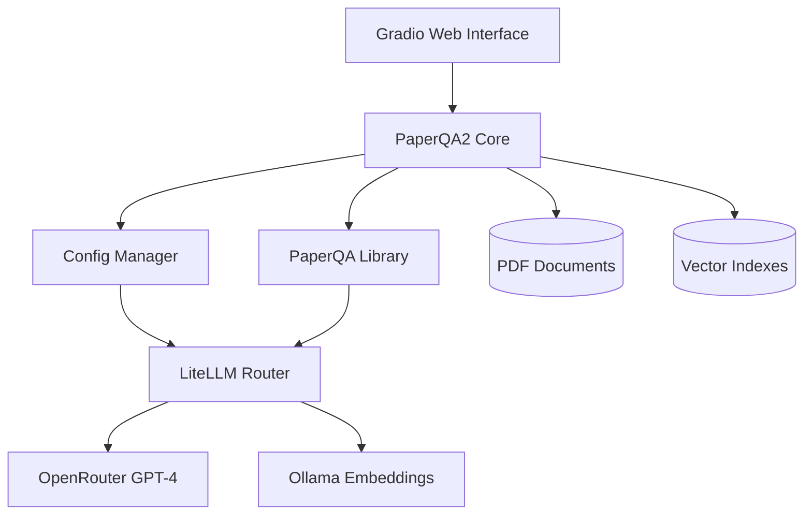
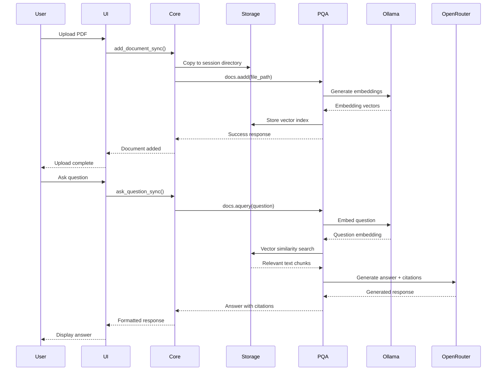
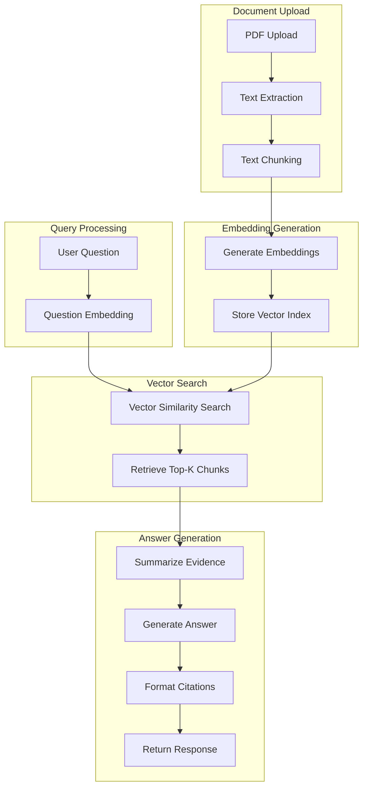
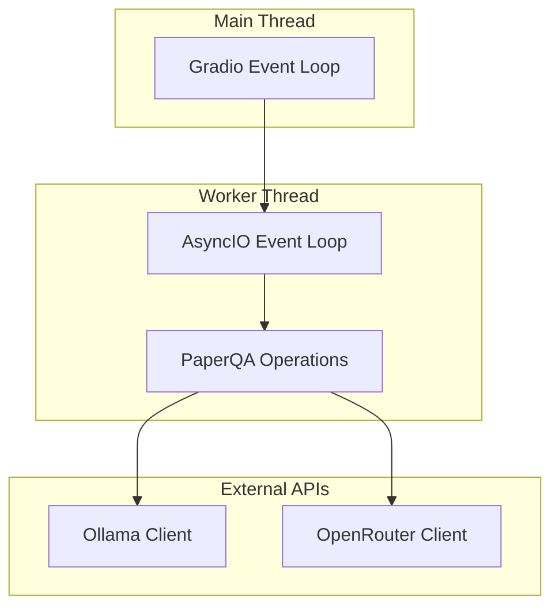

# Developer Documentation

## System Architecture



## Data Flow



## Component Details

### paperqa2_ui.py
Gradio web interface implementation.

**Key Functions:**
- `initialize_paperqa_core()` - Creates core instance with configuration
- `process_uploaded_files()` - Handles PDF uploads via sync wrapper
- `ask_question()` - Processes questions via sync wrapper
- `update_config()` - Switches AI model configurations

**Threading Model:**
Uses synchronous wrappers around async core methods to avoid Gradio event loop conflicts.

### paperqa2_core.py
Core business logic and PaperQA integration.

**Key Classes:**
- `PaperQA2Core` - Main processing class
- `PaperQACore` - Backward compatibility wrapper

**Async Methods:**
- `add_document()` - Process and index PDF files
- `ask_question()` - Query documents and generate answers

**Sync Wrappers:**
- `add_document_sync()` - Thread-safe document processing
- `ask_question_sync()` - Thread-safe question processing

**Session Management:**
- Each instance creates unique session directories
- Documents stored in `papers/session_<timestamp>/`
- Indexes stored in `indexes/session_<timestamp>/`

### config_manager.py
Configuration loading and validation.

**Configuration Structure:**
```json
{
  "llm": "openrouter/openai/gpt-4-turbo",
  "summary_llm": "openrouter/openai/gpt-4-turbo", 
  "agent_llm": "openrouter/openai/gpt-4-turbo",
  "embedding": "ollama/nomic-embed-text",
  "temperature": 0,
  "verbosity": 3,
  "answer": { ... },
  "parsing": { ... },
  "prompts": { ... },
  "agent": { ... }
}
```

## Processing Pipeline



## Configuration Parameters

### Core Settings
- `chunk_size`: 3000 characters per chunk
- `overlap`: 200 character overlap between chunks
- `evidence_k`: 15 top chunks retrieved for answering
- `answer_max_sources`: 15 maximum sources cited
- `temperature`: 0 (deterministic responses)

### Document Processing
- `use_doc_details`: false (disables Semantic Scholar metadata)
- `disable_doc_valid_check`: false (validates PDF structure)
- `defer_embedding`: false (immediate embedding generation)
- `page_size_limit`: 1,280,000 characters maximum per page

### Answer Generation
- `evidence_detailed_citations`: true (include page numbers)
- `answer_length`: "about 300 words, but can be longer"
- `max_concurrent_requests`: 3 (parallel processing limit)

## File Structure

```
├── src/
│   ├── paperqa2_ui.py          # Gradio interface (457 lines)
│   ├── paperqa2_core.py        # Core logic (339 lines)  
│   ├── config_manager.py       # Configuration (100+ lines)
│   ├── config_ui.py            # Config UI components
│   ├── streaming.py            # Streaming utilities
│   └── utils.py                # Utility functions
├── configs/
│   ├── default.json            # OpenRouter + Ollama setup
│   ├── ollama.json             # Local-only processing
│   ├── free_local.json         # Free tier models
│   ├── huggingface_free.json   # HuggingFace models
│   └── openrouter_optimized.json
├── scripts/
│   ├── kill_server.py          # Process management
│   ├── download_demo_papers.py # Sample data
│   ├── create_demo_dataset.py  # Demo content
│   └── paper_qa_cli.py         # CLI interface
├── papers/                     # Document storage (auto-created)
├── indexes/                    # Vector indexes (auto-created)
└── tests/                      # Test suite
```

## Dependencies

### Core Libraries
- `paperqa` - Document processing and Q&A engine
- `gradio` - Web interface framework
- `litellm` - Unified LLM access
- `asyncio` - Async processing
- `concurrent.futures` - Thread management

### AI Services
- OpenRouter API (GPT-4 Turbo)
- Ollama (nomic-embed-text embedding model)

### System Requirements
- Python 3.11+
- 8GB+ RAM (embedding model)
- Internet access (OpenRouter API)
- Local Ollama installation

## Error Handling

### Document Processing Errors
- File size validation (100MB limit)
- PDF corruption detection
- Text extraction failures
- Embedding generation timeouts

### API Errors
- OpenRouter rate limiting (HTTP 429)
- Ollama connection failures
- Network timeouts (300s default)
- Invalid API keys

### Session Management
- Automatic session directory creation
- File path validation
- Graceful cleanup on errors
- Event loop isolation in threading

## Performance Characteristics

### Document Processing
- PDF parsing: ~10-30 seconds per document
- Embedding generation: ~2-5 seconds per chunk
- Index storage: <1 second per document

### Question Answering  
- Vector search: <1 second
- Evidence summarization: ~5-15 seconds
- Answer generation: ~10-30 seconds
- Total response time: ~15-45 seconds

### Memory Usage
- Base system: ~500MB
- Per document: ~10-50MB (depending on size)
- Embedding model: ~2GB (nomic-embed-text)
- Vector indexes: ~5-20MB per document

## Threading Model



**Key Implementation Details:**
- Gradio runs in main thread with its own event loop
- PaperQA operations run in isolated worker threads
- Each worker thread creates new AsyncIO event loop
- HTTP clients properly closed after operations
- Timeout protection prevents hanging operations

## API Integration

### OpenRouter Configuration
```python
{
  "llm": "openrouter/openai/gpt-4-turbo",
  "summary_llm": "openrouter/openai/gpt-4-turbo",
  "agent_llm": "openrouter/openai/gpt-4-turbo"
}
```

### Ollama Configuration  
```python
{
  "embedding": "ollama/nomic-embed-text"
}
```

### LiteLLM Routing
All model calls routed through LiteLLM for unified interface and error handling.

## Development Setup

1. **Environment Setup:**
   ```bash
   make setup
   make install-dev
   ```

2. **Testing:**
   ```bash
   make test
   ```

3. **Code Formatting:**
   ```bash
   make format
   ```

4. **Code Linting:**
   ```bash
   make lint
   ```

## Known Issues

1. **Event Loop Closure:** Occasional "Event loop is closed" errors in test environments (not production UI)
2. **Memory Growth:** Vector indexes accumulate over sessions (cleared by restarting)
3. **API Rate Limits:** OpenRouter free tier has usage limits
4. **PDF Processing:** Some complex PDFs may fail text extraction

## Deployment Considerations

- Session directories grow over time (use `make clean-data` for cleanup)
- Ollama must be running before application start
- OpenRouter API key required for LLM operations
- Port 7860 must be available (configurable in code)
- File upload size limited by server configuration

## Maintenance Commands

```bash
make clean-data      # Clean session data (preserves papers/)
make clean-all-data  # Complete data reset (removes papers/)
make kill-server     # Stop hanging processes
make status          # Check system status
```