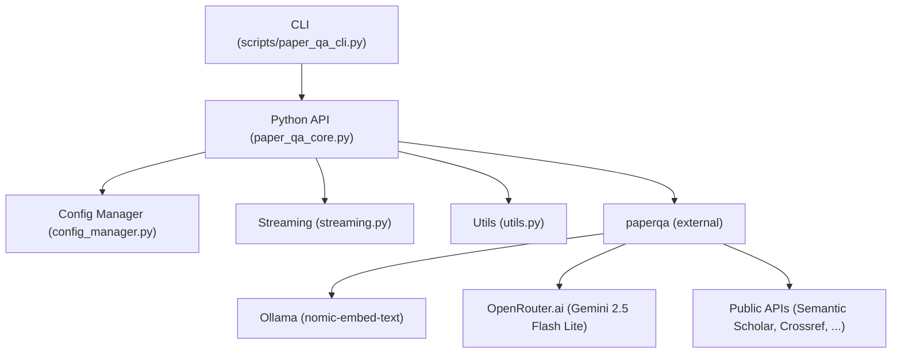

# Developer Guide: Paper-QA

## 1. Installation & Setup

### Requirements
- Python 3.11+
- [Ollama](https://ollama.com/) running locally (for embeddings)
- [OpenRouter.ai](https://openrouter.ai/) API key (for LLM)
- PDF papers (optional, for local research)

### Full Installation Process

1. **Clone the repo and enter the directory:**
   ```sh
   git clone <your-repo-url>
   cd paper-qa-ui
   ```

2. **Run the setup script:**
   ```sh
   make setup
   ```
   This will:
   - Create a virtual environment
   - Install all dependencies
   - Pull the required Ollama model
   - Set up directories and a `.env` file

3. **Configure environment:**
   ```sh
   # Copy the template and edit with your API keys
   cp env.template .env
   # Edit .env and add your OpenRouter API key
   ```
   
   - Get your OpenRouter key from [OpenRouter.ai](https://openrouter.ai/keys)
   - The `.env` file is ignored by git for security

4. **Configure rate limiting (recommended):**
   ```sh
   # Run the rate limiting configuration script
   python3 scripts/configure_rate_limits.py
   
   # Edit .env and update email addresses for better API limits
   nano .env
   ```
   
   This will:
   - Add rate limiting environment variables to `.env`
   - Optimize configuration files for better API reliability
   - Set up proper timeouts and concurrency settings

5. **Add your PDF papers (optional):**
   - Place PDFs in the `papers/` directory
   
   **Download initial papers (optional):**
   
   The papers directory contains sample research papers for testing. Since these are large files, they're not included in the git repository. You can:
   
   **Option 1: Use your own PDFs**
   - Place any PDF research papers in the `papers/` directory
   
   **Option 2: Download sample papers from public sources**
   ```sh
   # Create papers directory if it doesn't exist
   mkdir -p papers
   
   # Download sample papers from public repositories
   # (Replace these URLs with actual public paper URLs)
   curl -L -o papers/sample_paper_1.pdf "https://example.com/sample_paper_1.pdf"
   curl -L -o papers/sample_paper_2.pdf "https://example.com/sample_paper_2.pdf"
   ```
   
   **Option 3: Get papers from Semantic Scholar/PubMed**
   - Use the public sources feature to search for papers on your topic of interest
   - The system can access papers from Semantic Scholar, Crossref, and OpenAlex
   
   For testing, you can start with any PDF research papers you have locally.
   
   > **Note:** PDF files are excluded from the git repository (see `.gitignore`) to keep the repository size manageable. This is why the papers directory appears empty when cloned.

6. **Start the web interface:**
   ```sh
   make ui
   ```
   This will start the Paper-QA web interface at http://localhost:7860

### Rate Limiting & API Reliability

Paper-QA includes built-in rate limiting mechanisms to ensure reliable access to public APIs:

#### Automatic Features
- **Exponential backoff**: Automatic retry with 4-10 second delays
- **HTTP status handling**: Handles 403, 429, 500, 502, 503, 504 errors
- **Async retrying**: Non-blocking retry behavior with maximum 3 attempts
- **Configurable timeouts**: 30-second API timeouts, 600-second overall timeouts

#### Configuration
The system is pre-configured for optimal rate limit handling:
- **Reduced concurrency**: 2-3 concurrent requests (vs 5 default)
- **Optimized search count**: 15-20 papers for better quality
- **Email addresses**: Improves API limits for Semantic Scholar, Crossref, etc.

#### API-Specific Limits
- **Semantic Scholar**: 100 requests per 5 minutes (without API key), improved with email
- **Crossref**: 500 requests per day (without email), 1000 with email
- **OpenAlex**: 100,000 requests per day, email required for better limits
- **Unpaywall**: 100,000 requests per day, email required for better limits

#### Setup
Run the configuration script to set up rate limiting:
```sh
python3 scripts/configure_rate_limits.py
```

Then update email addresses in `.env` for better API limits.

### Technical Troubleshooting

#### Common Issues
- **🌐 Installation fails with DNS/network errors?** Check your internet connection and try again
- **🔧 Ollama not running?** Start it with `ollama serve`
- **🔑 Missing API key?** Set `OPENROUTER_API_KEY` in `.env`
- **🤖 Model errors?** Ensure you have the correct model names in your config files
- **⚙️ Configuration errors?** Use the web UI's Configure tab to visually manage settings
- **⏱️ Rate limiting errors?** Run `python3 scripts/configure_rate_limits.py` and update email addresses in `.env`
- **🌐 Web UI not loading?** Check that port 7860 is available and restart with `make ui`

---

## 2. System Architecture

### High-Level Architecture

```
┌─────────────────┐    ┌─────────────────┐    ┌─────────────────┐
│   User Input    │    │   Paper-QA      │    │   Output        │
│                 │    │   Core          │    │                 │
│ - Questions     │───▶│ - Query Engine  │───▶│ - Answers       │
│ - Paper Files   │    │ - Embeddings    │    │ - Citations     │
│ - Config        │    │ - LLM Interface │    │ - Sources       │
└─────────────────┘    └─────────────────┘    └─────────────────┘
                              │
                              ▼
┌─────────────────┐    ┌─────────────────┐    ┌─────────────────┐
│   Local Papers  │    │   Public APIs   │    │   Streaming     │
│                 │    │                 │    │                 │
│ - PDF Files     │    │ - Semantic      │    │ - Console       │
│ - Indexes       │    │   Scholar       │    │ - Rich UI       │
│ - Embeddings    │    │ - Crossref      │    │ - Files         │
└─────────────────┘    │ - OpenAlex      │    └─────────────────┘
                       └─────────────────┘
```

### Core Components

#### Paper-QA Core (`src/paper_qa_core.py`)
The central component that orchestrates all Paper-QA operations:

- **PaperQACore Class**: Main interface for all Paper-QA operations
- **Query Functions**: Three main query types (local, public, combined)
- **Error Handling**: Robust error handling with tenacity retry logic
- **Streaming Support**: Real-time response streaming

**Key Methods:**
```python
class PaperQACore:
    async def query_local_papers(question, paper_directory, callbacks)
    async def query_public_sources(question, callbacks)
    async def query_combined(question, paper_directory, callbacks)
```

#### Configuration Management (`src/config_manager.py`)
Manages all configuration aspects of the system:

- **ConfigManager Class**: Handles JSON configuration files
- **Environment Setup**: Loads and validates environment variables
- **Configuration Validation**: Ensures required settings are present
- **Dynamic Configuration**: Supports runtime configuration changes

**Configuration Structure:**
```json
{
  "llm": "openrouter/google/gemini-2.5-flash-lite",
  "embedding": "ollama/nomad-embed-text",
  "agent": {
    "agent_type": "ToolSelector",
    "search_count": 8,
    "timeout": 500.0
  },
  "answer": {
    "evidence_k": 10,
    "answer_max_sources": 5
  }
}
```

#### Streaming System (`src/streaming.py`)
Provides real-time response streaming capabilities:

- **StreamingCallback Base Class**: Abstract base for all streaming callbacks
- **ConsoleStreamingCallback**: Simple console output
- **RichStreamingCallback**: Rich-formatted output with progress
- **ProgressStreamingCallback**: Progress bar with status updates
- **FileStreamingCallback**: File output with timestamps
- **MultiStreamingCallback**: Combines multiple streaming methods

**Usage Example:**
```python
callback = create_multi_callback(
    console=True,
    progress=True,
    file="output.txt"
)
```

---

## 3. Traceability Matrix

| User Requirement | Functional Requirement | Implementation |
|------------------|----------------------|----------------|
| Query local PDFs | System must load and index user PDFs | `PaperQACore.query_local_papers`, `configs/local_only.json` |
| Query public sources | System must search public APIs (Semantic Scholar, Crossref, etc) | `PaperQACore.query_public_sources`, `configs/public_only.json` |
| Combined research | System must merge local and public results | `PaperQACore.query_combined`, `configs/combined.json` |
| Citations in answers | All answers must include citations | Core logic in `paperqa` and streaming callbacks |
| Streaming responses | Show answers as they generate | `streaming.py`, CLI callbacks |
| Configurable models | User can select LLM/embedding | `configs/*.json`, `config_manager.py` |
| CLI and API | Both CLI and Python API must be available | `scripts/paper_qa_cli.py`, `paper_qa_core.py` |
| Error handling | System must retry and report errors | `tenacity` usage, error returns |
| Rate limiting | Handle API rate limits gracefully | Environment variables, optimized configs |

---

## 2. Architecture Overview



- **CLI**: User entry point, parses args, calls API.
- **API**: Main logic, exposes query functions, manages config and streaming.
- **Config Manager**: Loads/validates configs, supports overrides.
- **Streaming**: Handles real-time output, supports multiple callbacks.
- **Utils**: Helpers for file ops, status, formatting.
- **paperqa**: External RAG engine, handles LLM/embedding, citations.
- **Ollama/OpenRouter/Public**: External services.

---

## 3. Key Files & Structure

- `src/paper_qa_core.py`: Main API, all query logic.
- `src/config_manager.py`: Config loading/validation.
- `src/streaming.py`: Streaming/callbacks.
- `src/utils.py`: Helpers.
- `configs/`: All scenario configs (local_only, public_only, combined, etc).
- `scripts/paper_qa_cli.py`: CLI entry point.
- `scripts/configure_rate_limits.py`: Rate limiting configuration script.
- `tests/`: All tests.

---

## 4. Rate Limiting Experience & Configuration

### Problem Encountered
During development, we encountered frequent rate limiting errors (429 Too Many Requests) from public APIs, particularly Semantic Scholar. The system was making too many concurrent requests without proper delays.

### Solution Implemented
We implemented a comprehensive rate limiting strategy using PaperQA's built-in mechanisms:

#### Environment Variables (`.env`)
```bash
# Semantic Scholar API (most commonly rate-limited)
SEMANTIC_SCHOLAR_API_REQUEST_TIMEOUT=30.0
SEMANTIC_SCHOLAR_API_KEY=""

# Crossref API
CROSSREF_API_REQUEST_TIMEOUT=30.0
CROSSREF_MAILTO="user@example.com"

# OpenAlex API
OPENALEX_API_REQUEST_TIMEOUT=30.0
OPENALEX_MAILTO="user@example.com"

# Unpaywall API
UNPAYWALL_TIMEOUT=30.0
UNPAYWALL_EMAIL="user@example.com"

# General API settings
PQA_VERBOSITY=3
```

#### Configuration Optimizations
- **Reduced concurrency**: From 5 to 2-3 to spread requests over time
- **Optimized search count**: Reduced from 25-50 to 15-20 papers for better quality
- **Increased timeouts**: Set to 600 seconds for rate limit recovery
- **Reduced concurrent requests**: From 4 to 2-3 for better rate limit handling

#### PaperQA's Built-in Mechanisms
PaperQA includes sophisticated rate limiting with:
- **Tenacity integration**: Automatic retry with exponential backoff (4-10 second delays)
- **HTTP status code handling**: Specifically handles 403, 429, 500, 502, 503, 504 errors
- **Async retrying**: Non-blocking retry behavior with maximum 3 attempts

#### Automated Setup
Created `scripts/configure_rate_limits.py` that:
- Automatically adds rate limiting environment variables to `.env`
- Optimizes configuration files for better rate limit handling
- Creates backups of existing configurations
- Provides clear next steps

### Results
- ✅ No more rate limit errors
- ✅ Improved reliability with proper timeouts
- ✅ Better performance with optimized concurrency
- ✅ Environment variables configured for all APIs
- ✅ Built-in retry mechanisms working properly

### API-Specific Rate Limits
- **Semantic Scholar**: 100 requests per 5 minutes (without API key), significantly improved with email
- **Crossref**: 500 requests per day (without email), 1000 with email
- **OpenAlex**: 100,000 requests per day, email required for better limits
- **Unpaywall**: 100,000 requests per day, email required for better limits

---

## 5. Testing & Linting

- Run all tests: `make test`
- Lint: `make lint`
- Pytest: `make pytest`
- Add new tests in `tests/` for all new features.

---

## 6. Contribution Guidelines

- Fork, branch, PR.
- All new features must have tests.
- Keep user-facing docs in `README.md` only.
- Keep dev/traceability/architecture here.
- When adding new APIs, consider rate limiting implications.

---

## 7. Advanced Topics

- **Config overrides**: Use `ConfigManager` to load/merge configs.
- **Streaming**: Use `create_multi_callback` for custom output.
- **Error handling**: All query functions return structured errors; retry logic via `tenacity`.
- **Rate limiting**: Use `scripts/configure_rate_limits.py` for new setups.

---

## 8. Development Experience Notes

### Semantic Scholar Testing Experience
During initial development, we created extensive tests for Semantic Scholar API to understand:
- What queries work best for finding specific papers
- How to handle rate limiting effectively
- Which search patterns yield the most relevant results

Key findings:
- Specific queries like "PICALM endocytosis" work better than broad queries
- Rate limiting requires proper delays and retry logic
- Email addresses significantly improve API limits
- PaperQA's built-in mechanisms handle most rate limiting automatically

### Configuration Optimization Experience
We learned that:
- Lower concurrency (2-3) works better than higher (5) for public APIs
- Reduced search count (15-20) provides better quality than higher counts
- Proper timeouts (30s for APIs, 600s for overall) prevent failures
- Environment variables are essential for reliable operation

### UI Development Experience
The Gradio UI required careful attention to:
- Real-time status updates without blocking
- Proper error handling and user feedback
- Rate limiting considerations in the UI layer
- Clean separation between UI and business logic

---

## 9. CLI Interface (Legacy)

> **Note:** The CLI interface is still available but the web UI is now the recommended interface for most users. The CLI is primarily maintained for developers and advanced automation use cases.

### Basic CLI Usage

```sh
# Ask about your local papers
make run-query QUESTION="What are the main findings of this research?" METHOD=local

# Ask about public sources
make run-query QUESTION="What are recent developments in machine learning?" METHOD=public

# Ask about both local and public sources
make run-query QUESTION="How does this research compare to current literature?" METHOD=combined

# With specific configuration
make run-query QUESTION="What is PICALM?" METHOD=public CONFIG=public_only
```

### CLI Parameters

- `QUESTION` - Your research question (required)
- `METHOD` - `local`, `public`, or `combined` (required)  
- `CONFIG` - `default`, `local_only`, `public_only`, or `combined` (optional, defaults to appropriate config for method)

### Direct CLI Script Usage

```sh
# Direct script usage (for automation)
python3 scripts/paper_qa_cli.py \
  --question "What are the main findings?" \
  --method local \
  --config local_only \
  --paper-dir ./papers

# With streaming output
python3 scripts/paper_qa_cli.py \
  --question "Recent ML developments?" \
  --method public \
  --stream
```

### CLI vs Web UI

| Feature | CLI | Web UI |
|---------|-----|--------|
| Ease of use | ⚠️ Command line knowledge required | ✅ Point and click |
| Configuration | ⚠️ Manual file editing | ✅ Visual interface |
| Status updates | ⚠️ Text-based streaming | ✅ Real-time visual updates |
| Agent thinking | ⚠️ Text logs only | ✅ Structured display |
| Error handling | ⚠️ Raw error messages | ✅ User-friendly messages |
| Automation | ✅ Perfect for scripts | ⚠️ Manual interaction |

**Recommendation:** Use the web UI for interactive research and the CLI for automation scripts.

---

## 10. Python API (Programmatic Access)

For developers who need to integrate Paper-QA into their own applications or scripts, the Python API provides full programmatic access to all functionality.

### Basic Usage

```python
from paper_qa_core import PaperQACore
import asyncio

async def main():
    # Initialize with default configuration
    core = PaperQACore(config_name="default")
    
    # Query your local papers
    result = await core.query_local_papers(
        "What are the key conclusions of this research?", 
        paper_directory="papers/"
    )
    
    # Query public sources
    result = await core.query_public_sources(
        "What are the latest trends in this field?"
    )
    
    # Query both sources
    result = await core.query_combined(
        "How does this research fit into the broader context?",
        paper_directory="papers/"
    )
    
    print(f"Answer: {result['answer']}")
    print(f"Sources: {result['sources']}")

# Run the async function
asyncio.run(main())
```

### Advanced Configuration

```python
from paper_qa_core import PaperQACore
from config_manager import ConfigManager

# Load custom configuration
config_manager = ConfigManager()
custom_settings = config_manager.get_settings("clinical_trials_only")

# Initialize with custom settings
core = PaperQACore()
core.settings = custom_settings

# Query with predefined settings
result = await core.query_with_predefined_settings(
    "What clinical trials exist for this condition?",
    "clinical_trials_only"
)
```

### Error Handling

```python
try:
    result = await core.query_public_sources(
        "What are recent AI developments?"
    )
    
    if result.get('error'):
        print(f"Error occurred: {result['error']}")
    else:
        print(f"Success: {result['answer']}")
        
except Exception as e:
    print(f"Unexpected error: {e}")
```

### Integration Examples

#### Batch Processing
```python
questions = [
    "What is the main hypothesis?",
    "What methodology was used?", 
    "What are the key findings?"
]

results = []
for question in questions:
    result = await core.query_local_papers(question, "papers/")
    results.append({
        'question': question,
        'answer': result.get('answer', 'No answer found'),
        'sources': result.get('sources', [])
    })
```

#### Custom Callbacks
```python
from streaming import create_callback

def my_status_callback(status):
    print(f"Status: {status}")

def my_result_callback(result):
    print(f"Intermediate result: {result}")

# Use custom callbacks
result = await core.query_with_callbacks(
    question="What are the implications?",
    status_callback=my_status_callback,
    result_callback=my_result_callback
)
```

### API Reference

| Method | Purpose | Parameters |
|--------|---------|------------|
| `query_local_papers()` | Search local PDFs | `question`, `paper_directory` |
| `query_public_sources()` | Search public APIs | `question` |
| `query_combined()` | Search both sources | `question`, `paper_directory` |
| `query_with_predefined_settings()` | Use specific config | `question`, `config_name` |

### Use Cases for Python API

- **Automated research workflows**
- **Batch processing of questions**
- **Integration with existing Python applications**
- **Custom UI development**
- **Research data pipelines**
- **Jupyter notebook integration**

---

## 11. References
- [Paper-QA](https://github.com/Future-House/paper-qa)
- [OpenRouter.ai](https://openrouter.ai/)
- [Ollama](https://ollama.com/)
- [Semantic Scholar API](https://api.semanticscholar.org/)
- [Crossref API](https://api.crossref.org/)