# Paper-QA: Scientific Paper Question Answering

## What is Paper-QA?
Paper-QA lets you ask research questions and get answers with citations from your own PDF papers and public sources (like Semantic Scholar, Crossref, OpenAlex). It uses state-of-the-art AI models for both language and embeddings, and is designed for scientists, students, and anyone who needs reliable, cited answers from the literature.

---

## User Journey & Features

```mermaid
graph TD
    A[👤 Researcher has a question] --> B{📚 What sources?}
    
    B -->|My PDFs| C[📁 Upload papers to /papers]
    B -->|Public literature| D[🌐 Use public databases]
    B -->|Both| E[🔄 Combined search]
    
    C --> F[🚀 Start Paper-QA UI]
    D --> F
    E --> F
    
    F --> G[❓ Ask research question]
    G --> H{🔍 Choose search method}
    
    H -->|Local Only| I[📖 Search uploaded PDFs]
    H -->|Public Only| J[🔍 Search Semantic Scholar<br/>Crossref, OpenAlex]
    H -->|Combined| K[🔄 Search both sources]
    H -->|Clinical Trials| L[🏥 Search clinical databases]
    
    I --> M[🤖 AI Agent processes]
    J --> M
    K --> M
    L --> M
    
    M --> N[📊 Real-time status updates]
    M --> O[🧠 Agent thinking process]
    M --> P[📚 Evidence gathering]
    
    P --> Q[✍️ Generate answer with citations]
    Q --> R[📝 Formatted response]
    
    R --> S{😊 Satisfied?}
    S -->|No| T[🔧 Adjust configuration]
    S -->|Yes| U[✅ Research complete]
    
    T --> G
    
    style A fill:#e1f5fe
    style F fill:#f3e5f5
    style M fill:#fff3e0
    style R fill:#e8f5e8
    style U fill:#e8f5e8
```



**Key Capabilities:**
- 🌐 **Zero setup web interface** - Just run `make ui` and go!
- 🤖 **AI-powered research assistant** with real-time thinking process
- 📚 **Multi-source search**: Your PDFs + public literature + clinical trials
- 📝 **Automatic citations** for every piece of evidence
- ⚡ **Streaming responses** with live status updates
- 🔧 **Visual configuration** - no config file editing needed
- 🚀 **Enterprise-grade**: Rate limiting, error handling, retry logic

---

## Requirements
- Python 3.11+
- [Ollama](https://ollama.com/) running locally (for embeddings)
- [OpenRouter.ai](https://openrouter.ai/) API key (for LLM)
- PDF papers (optional, for local research)

---

## Quick Start

1. **Clone the repo and enter the directory:**
   ```sh
   git clone <your-repo-url>
   cd paper-qa-ui
   ```

2. **Run the setup script:**
   ```sh
   make setup
   ```
   This will:
   - Create a virtual environment
   - Install all dependencies
   - Pull the required Ollama model
   - Set up directories and a `.env` file

3. **Configure environment:**
   ```sh
   # Copy the template and edit with your API keys
   cp env.template .env
   # Edit .env and add your OpenRouter API key
   ```
   
   - Get your OpenRouter key from [OpenRouter.ai](https://openrouter.ai/keys)
   - The `.env` file is ignored by git for security

4. **Configure rate limiting (recommended):**
   ```sh
   # Run the rate limiting configuration script
   python3 scripts/configure_rate_limits.py
   
   # Edit .env and update email addresses for better API limits
   nano .env
   ```
   
   This will:
   - Add rate limiting environment variables to `.env`
   - Optimize configuration files for better API reliability
   - Set up proper timeouts and concurrency settings

5. **Add your PDF papers:**
   - Place PDFs in the `papers/` directory
   
   **Download initial papers (optional):**
   
   The papers directory contains sample research papers for testing. Since these are large files, they're not included in the git repository. You can:
   
   **Option 1: Use your own PDFs**
   - Place any PDF research papers in the `papers/` directory
   
   **Option 2: Download sample papers from public sources**
   ```sh
   # Create papers directory if it doesn't exist
   mkdir -p papers
   
   # Download sample papers from public repositories
   # (Replace these URLs with actual public paper URLs)
   curl -L -o papers/sample_paper_1.pdf "https://example.com/sample_paper_1.pdf"
   curl -L -o papers/sample_paper_2.pdf "https://example.com/sample_paper_2.pdf"
   ```
   
   **Option 3: Get papers from Semantic Scholar/PubMed**
   - Use the public sources feature to search for papers on your topic of interest
   - The system can access papers from Semantic Scholar, Crossref, and OpenAlex
   
   For testing, you can start with any PDF research papers you have locally.
   
   > **Note:** PDF files are excluded from the git repository (see `.gitignore`) to keep the repository size manageable. This is why the papers directory appears empty when cloned.

6. **Start the web interface:**
   ```sh
   make ui
   ```
   This will start the Paper-QA web interface at http://localhost:7860
   
   🎉 **That's it!** Open your browser and start asking questions about your research papers!

---

## 📖 Documentation

- **[📚 User Manual](docs/user_manual.md)** - Comprehensive guide to all features and functionality
- **[🔧 Developer Guide](DEVELOPER.md)** - Technical details for developers
- **[🏗️ Architecture](Architecture.md)** - System architecture and design

## Usage

### 🌐 Web Interface (Recommended)
Start the web interface with:
```sh
make ui
```
Then open http://localhost:7860 in your browser.

**🎯 Key Features:**
- **🔍 Query Papers Tab**: Ask questions with multiple search methods
- **⚙️ Configure Tab**: Complete configuration management through the UI
- **🤖 Agent Thinking Process**: See exactly how the AI processes your questions
- **📚 Detailed Context Information**: View the specific information used
- **📊 Real-time Status Updates**: Live feedback on query progress
- **💡 Example Questions**: Pre-built questions to get you started

**🔍 Search Methods:**
- **Public Only**: Search online sources (Semantic Scholar, Crossref, OpenAlex)
- **Local Only**: Search your uploaded PDF papers
- **Combined**: Search both local and public sources  
- **Clinical Trials**: Search clinical trials databases
- **Comprehensive**: Advanced search with multiple strategies

**💡 Example Questions to Try:**
- "What are the main findings of this research?"
- "What are recent developments in machine learning?"
- "How does this research compare to current literature?"
- "What are the limitations of this study?"
- "What future research directions are suggested?"

### 💻 Advanced Usage
For automation, scripting, and programmatic access, see the [Developer Guide](DEVELOPER.md) which covers:
- **Command Line Interface** for automation
- **Python API** for programmatic integration
- **Configuration management** for advanced setups

### 💡 Example Questions for Any Research Papers
- "What is the main research question being addressed?"
- "What methodology was used in this study?"
- "What are the key findings and conclusions?"
- "What are the limitations of this research?"
- "How does this work contribute to the field?"
- "What future research directions are suggested?"

---

## Rate Limiting & API Reliability

Paper-QA includes built-in rate limiting mechanisms to ensure reliable access to public APIs:

### Automatic Features
- **Exponential backoff**: Automatic retry with 4-10 second delays
- **HTTP status handling**: Handles 403, 429, 500, 502, 503, 504 errors
- **Async retrying**: Non-blocking retry behavior with maximum 3 attempts
- **Configurable timeouts**: 30-second API timeouts, 600-second overall timeouts

### Configuration
The system is pre-configured for optimal rate limit handling:
- **Reduced concurrency**: 2-3 concurrent requests (vs 5 default)
- **Optimized search count**: 15-20 papers for better quality
- **Email addresses**: Improves API limits for Semantic Scholar, Crossref, etc.

### API-Specific Limits
- **Semantic Scholar**: 100 requests per 5 minutes (without API key), improved with email
- **Crossref**: 500 requests per day (without email), 1000 with email
- **OpenAlex**: 100,000 requests per day, email required for better limits
- **Unpaywall**: 100,000 requests per day, email required for better limits

### Setup
Run the configuration script to set up rate limiting:
```sh
python3 scripts/configure_rate_limits.py
```

Then update email addresses in `.env` for better API limits.

---

## Troubleshooting

### Common Issues
- **🔧 Ollama not running?** Start it with `ollama serve`.
- **🔑 Missing API key?** Set `OPENROUTER_API_KEY` in `.env`.
- **🤖 Model errors?** Ensure you have the correct model names in your config files.
- **❓ "I cannot answer" responses?** Try:
  - Rephrasing your question to be more specific
  - Using a different search method (try "Combined" instead of "Public Only")
  - Adding scientific terminology to your question
  - Using the example questions as templates
- **⚙️ Configuration errors?** Use the web UI's Configure tab to visually manage settings
- **⏱️ Rate limiting errors?** Run `python3 scripts/configure_rate_limits.py` and update email addresses in `.env`
- **🌐 Web UI not loading?** Check that port 7860 is available and restart with `make ui`

### Getting Help
- 📚 **Detailed guides:** See [User Manual](docs/user_manual.md)
- 🔧 **Technical details:** See [Developer Guide](DEVELOPER.md)
- 🏗️ **Architecture info:** See [Architecture](Architecture.md)
- 🐛 **Still stuck?** Open an issue on GitHub

---

## License
MIT
