# Paper-QA: Scientific Paper Question Answering

## What is Paper-QA?
[Paper-QA](https://github.com/Future-House/paper-qa) is an AI research assistant that helps you find answers to scientific questions with proper citations. It searches both your own PDF papers and millions of published papers from databases like Semantic Scholar, Crossref, and OpenAlex.

**Perfect for:** Literature reviews, grant writing, staying current with research, and exploring new fields.

This is a Web based Front end for the already great paper-qa. I built this UI for self education.

---

## A Visual Guide for how this works

```mermaid
graph LR
    A[📝 Research Query] --> B[⚙️ Choose Configuration]
    
    B --> C[🔍 Search Sources]
    C --> D[🤖 AI Processing]
    D --> E[📊 Cited Answer]
    
    subgraph "Configuration Options"
        F[public_only<br/>📚 Literature Review]
        G[local_only<br/>📁 Your PDFs]
        H[combined<br/>🔄 Both Sources]
        I[clinical_trials<br/>🏥 Medical Research]
    end
    
    subgraph "Key Parameters"
        J[Search Count: 15-50]
        K[Evidence K: 10-30]
        L[Temperature: 0.0-0.5]
    end
    
    B -.-> F
    B -.-> G
    B -.-> H
    B -.-> I
    
    style A fill:#e3f2fd
    style B fill:#1976d2,color:#fff
    style C fill:#ff9800,color:#fff
    style D fill:#ff9800,color:#fff
    style E fill:#4caf50,color:#fff
```

---

## 🚀 Getting Started

**New to Paper-QA?** Just want to start asking research questions? Here's all you need:

### ⚡ Quick Start (3 Steps)
1. **Get the system running** see Developer notes below for how to run it.
2. **Open your browser** to http://localhost:7860 
3. **Start asking questions!** 

That's it! No folders to create, no PDFs to upload unless you want to search your own papers.

### 🔍 What You Can Do Right Away
- **Ask any research question** and get cited answers from millions of published papers
- **Search public literature** - no setup needed, works immediately  
- **Upload your own PDFs** later if you want to search your personal collection
- **Try different search methods** to get the best answers for your questions

### 📚 Example Questions to Try
- "What are the latest treatments for Alzheimer's disease?"
- "How does CRISPR gene editing work?"
- "What are the side effects of statins?"
- "What is the current understanding of long COVID?"

> **🔧 Need to set this up yourself?** See the [Developer Guide](DEVELOPER.md) for full installation instructions.

---

## 📖 Documentation

- **[🔧 Developer Guide](DEVELOPER.md)** - Installation, technical details, and system architecture

## 🌐 Using Paper-QA

### 🎯 Main Interface Features
- **🔍 Ask Questions**: Type any research question in plain English
- **⚙️ Choose Search Type**: Public literature, your PDFs, or both
- **🤖 Watch AI Think**: See how the AI finds and analyzes papers
- **📚 Get Cited Answers**: Receive detailed answers with proper citations
- **🔧 Adjust Settings**: Fine-tune search depth and answer style

### 🔍 Search Options

#### 🌐 Public Literature
**Best for**: Staying current with published research, exploring new fields
- Search millions of papers from Semantic Scholar, Crossref, OpenAlex
- No setup needed - works immediately
- Great for literature reviews and background research

#### 📁 Your PDFs  
**Best for**: Analyzing your own research collection
- Upload PDFs to search your personal paper library
- Perfect for manuscript writing and data analysis
- Ask your IT team to add papers to the system

#### 🔄 Combined Search
**Best for**: Comprehensive research, comparing your work to published literature  
- Searches both public databases AND your uploaded papers
- Most thorough results for grant writing and manuscript preparation

#### 🏥 Clinical Trials
**Best for**: Treatment options, drug development status, patient recruitment
- Searches clinicaltrials.gov database
- Find active trials, completed studies, and trial results

### ⚙️ Professional Configuration

#### Configuration Presets
| Config | Use Case | Search Sources | Agent Tools | Performance |
|--------|----------|----------------|-------------|-------------|
| `public_only` | Literature review, staying current | Semantic Scholar, Crossref, OpenAlex | Basic search + answer | Fast |
| `local_only` | Private research, manuscript writing | Your PDF collection | PDF indexing + search | Medium |
| `combined` | Comprehensive research | Public APIs + Local PDFs | Multi-source synthesis | Medium |
| `clinical_trials` | Medical research, drug development | ClinicalTrials.gov + Public APIs | Clinical data focus | Medium |
| `comprehensive` | Deep research, grant writing | All sources + advanced strategies | Full agent toolkit | Slow |
| `agent_optimized` | Complex queries, multi-step reasoning | All sources | Advanced reasoning tools | Slowest |

#### Key Parameters for Optimization
- **Search Count** (1-100): Papers to retrieve per query
  - 15-20: Quick answers, current literature
  - 25-40: Comprehensive reviews  
  - 50+: Exhaustive research
- **Evidence K** (1-100): Evidence pieces for answer generation
  - 10-15: Focused, concise answers
  - 20-30: Detailed analysis
  - 40+: Comprehensive synthesis
- **Temperature** (0.0-2.0): LLM creativity/consistency
  - 0.0-0.1: Factual, reproducible answers
  - 0.2-0.5: Balanced responses
  - 0.6+: Creative interpretations
- **Max Sources** (1-50): Citations in final answer
- **Timeout** (30-3600s): Query processing time limit

### 💻 For Developers & Automation
Need to integrate Paper-QA into scripts or applications? See the [Developer Guide](DEVELOPER.md) for:
- Command line interface
- Python API
- Advanced configuration

---
