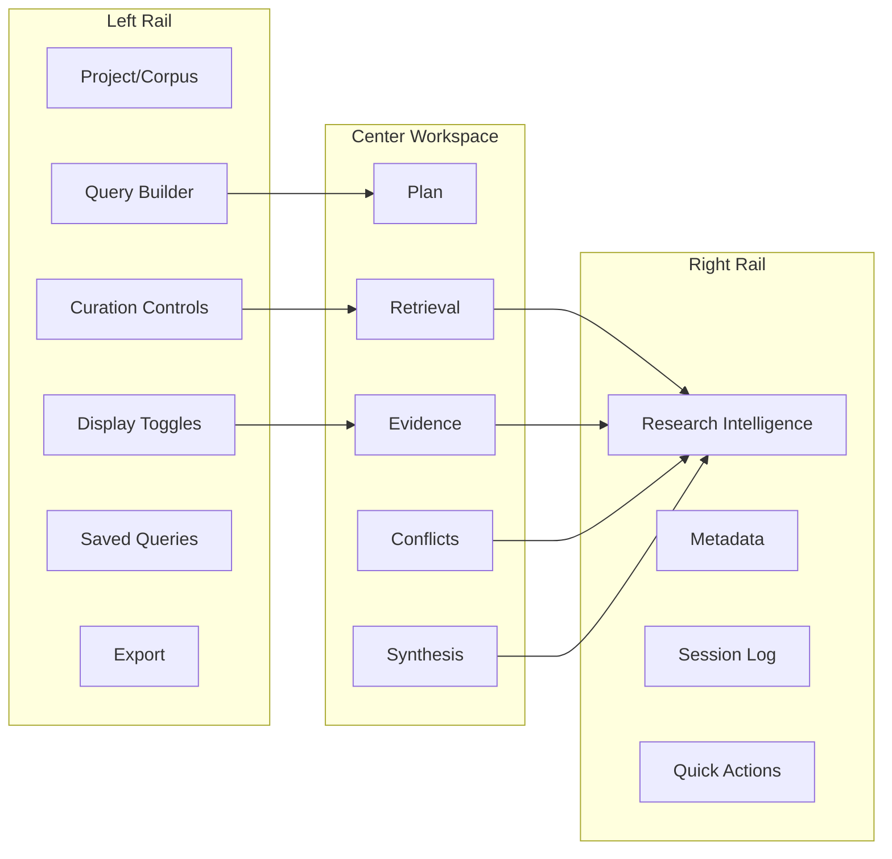
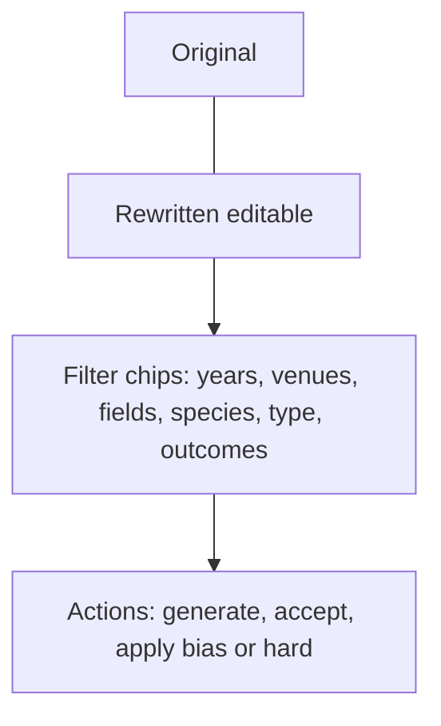
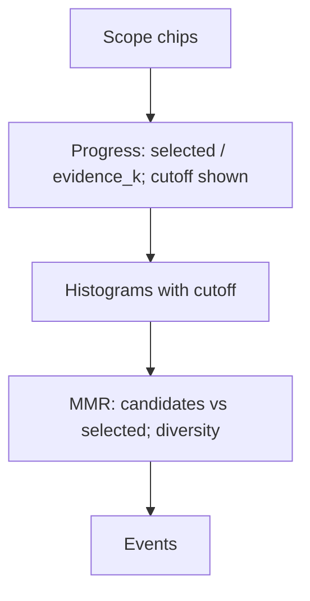
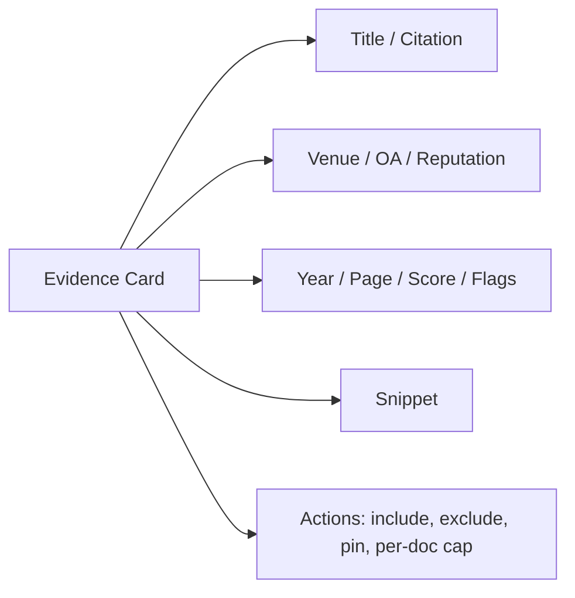
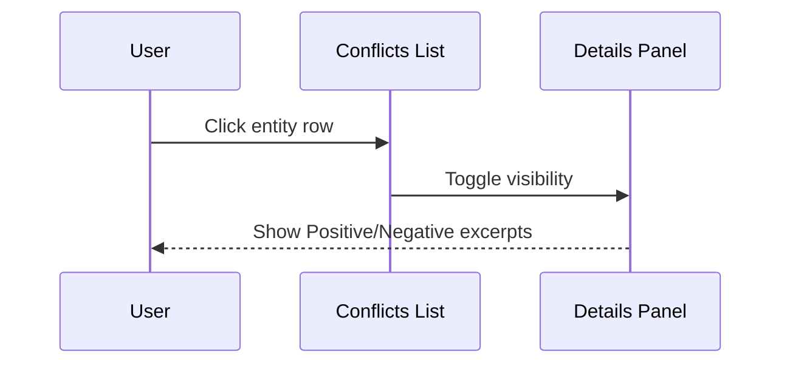
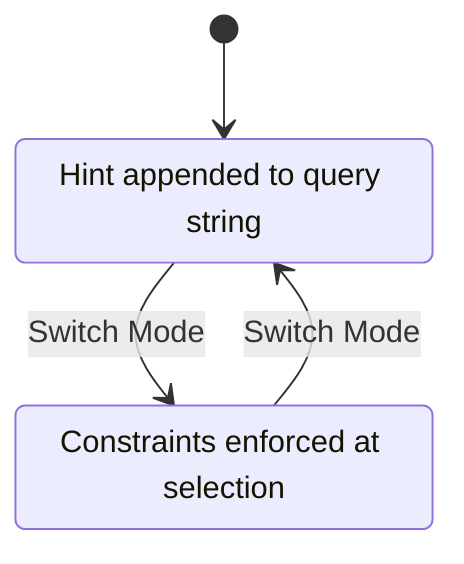
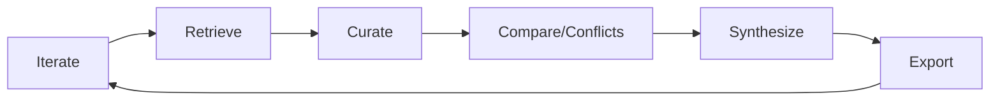

# Paper-QA UI: UX Strategy (Data Scientists)

This document defines the UI/UX direction for a literature-analysis workflow purpose-built for data scientists. It focuses on verifiable scope control, transparent evidence handling, and fast iteration.

## Principles
- Query-first, reproducible: Every scope/filter/edit is auditable and exportable.
- Tight loop: Clarify → Scope → Retrieve → Curate → Compare → Synthesize → Export → Iterate.
- Evidence-centric: Controls and visuals reflect how scientists judge relevance, diversity, quality, and conflict.
- Flat learning curve: All controls state exactly what they do; safe defaults; predictable outcomes.

## Information Architecture (IA)
- Left rail
  - Project/Corpus
  - Query Builder (LLM rewrite + manual filters)
  - Curation Controls
  - Display Toggles
  - Saved Queries
  - Export
- Center workspace (tabs)
  - Plan (question decomposition/rewrites)
  - Retrieval (live progress, scope confirmation)
  - Evidence (ranked list + charts, curation actions)
  - Conflicts (clustered disagreement, drill-down)
  - Synthesis (answer, critique, provenance)
- Right rail
  - Research Intelligence (live)
  - Metadata
  - Session Log (events/timestamps)
  - Quick Actions

## Query Builder (LLM rewrite + manual filters)
- Query text area:
  - Side-by-side: Original vs Rewritten.
  - In-place edit of Rewritten; “Reset to LLM suggestion” restores.
  - Always show the exact string used for retrieval (Query Used).
- LLM suggestions:
  - “Suggest scopes” chips based on the question: years, venues, fields, species, models, study types, outcomes.
  - Chips are togglable/editable; changes reflect downstream.
- Manual filters (facets):
  - Years: range slider; distribution histogram to choose bounds.
  - Venues: typeahead with normalization (PubMed lists); show OA when present.
  - Fields: ontology picker (NCIt/BioPortal); chips carry term CURIE/ID.
  - Species / Model: human, mouse, cell line (controlled vocab suggestions).
  - Study type: trial, cohort, mechanistic, review (controlled terms).
  - Outcomes/entities: e.g., Aβ, tau, BBB; term extraction suggests common entities.
- Bias vs hard filter modes:
  - Bias retrieval: append hints into Rewritten text (soft influence).
  - Hard filter: enforce constraints at ranking/selection (strong influence). Clear mode badges.

## Retrieval (Live Progress)
- One large panel showing:
  - Rewritten from + Rewritten (editable); Query Used summary.
  - Scope summary: chips for years/venues/fields/modes with toggle state.
  - Progress bar: selected/evidence_k; show ≥cutoff contexts.
  - Cutoff-aware histograms: show impact of changing cutoff (ghosted bins).
  - MMR live: candidate vs selected histogram; diversity share; candidate count.
  - Status log: most recent structured events.

## Evidence (Curation-first)
- Top summary widgets: selected, ≥cutoff, unique venues, preprint share, years histogram, diversity score.
- Left filters-by-facet reflect current results (years, venues, fields); changes update list live.
- Evidence cards (right):
  - Title/citation, venue (OA/reputation when available), year, score, page, flags (preprint/retracted?), snippet.
  - Actions: include/exclude; pin; per-doc cap inline (quick control).
  - Hover shows provenance (DOI/PMID when available).
- Charts: larger, filtered distributions (scores, years, venues) tied to current selection.
- Bottom bar: curation settings summary (score cutoff, per-doc cap, max sources) with quick edit.

## Conflicts (click-to-expand, polarity-grouped)
- Cluster table by entity/claim:
  - Columns: Entity, #sources mixed, sample sources, Expand.
  - On expand: polarity sections with excerpt tiles (snippet + source); “view full” opens minimal modal with context.
  - Actions: mark resolved (notes), exclude a source for this entity (local to session).
- Keep "unresolved conflicts" counter visible.

## Synthesis (answer + critique + provenance)
- Left: answer (markdown), inline citations back to evidence cards.
- Right: critique pane:
  - Numbered list normalized (e.g., "\\1 foo" → ordered list).
  - Categories: unsupported, overconfident, contradictory, missing data.
  - Clicking a critique item highlights implicated evidence.
- Provenance drawer: which sources included, filters used, rewrite string, events with timestamps.

## Display Toggles
- Show/hide source flags
- Show/hide conflicts
- Show/hide histograms
- Dense vs spacious card layout

## Saved Queries & Reproducibility
- Save snapshots: rewritten query, facets, curation, toggles.
- Diff snapshots to see changes (filters/curation/toggles).
- Export session with a machine-readable methods block (JSON/CSV/JSONL + methods text).

## Rewrite UX (Detailed)
- Plan tab, single pane:
  - Left: Original; Right: Rewritten; below: filter chips.
  - Actions: Generate rewrite (LLM), Accept rewrite (commit), Apply filters as Bias vs Hard Filter.
  - Manual term search for fields/species/outcomes via NCIt/BioPortal lookup.
  - Year slider with histogram; venue selector with typeahead normalization.
- Provenance captured: model name, timestamp, prompt shape (not full prompt), selected filters, mode (bias/hard).
- Keyboard: cmd/ctrl+enter = generate; enter on chip = apply.

## Metadata and Venue Indicators (when available)
- Venue display under each source:
  - Venue string (journal/conference), OA flag (if known), simple reputation proxy (configured mapping or heuristic). Hidden if metadata absent.

## Performance
- Throttle heavy visualizations; only refresh key metrics in live loop.
- Use snapshots to revisit states without recomputation.

## Implementation Plan (Incremental)
1) Plan tab + Rewrite editor
   - Side-by-side Original/Rewritten, LLM generate + heuristic fallback, filter chips; Bias vs Hard filter modes; commit rewrite to Query Used. Save rewrite in export.
2) Evidence panel upgrades
   - Venue line + OA/reputation proxy; inline per-doc cap; charts.
3) Conflicts drill-down
   - Expandable items; polarity sections with top excerpts; minimal modal for context.
4) Live histograms and cutoff
   - Reflect cutoff adjustments in place (ghosted bars) before apply.
5) Saved queries + diff
   - Save/load named snapshots; diff filters/curation.

## Mapping to Current App
- Query Builder/Rewrite: we already render Original/Rewritten, LLM rewrite, and bias. Add Plan tab, accept/edit UI, hard filter mode.
- Evidence curation: controls + preview exist; add per-doc cap inline; venue line; enhance charts.
- Conflicts: list exists; add clickable expansion and excerpts per polarity.
- Export: rewrite/curation included; add hard filters when implemented.

## First Steps
- Add Plan tab and rewrite/editor controls with chips and bias/hard modes.
- Expose venue indicators from `doc.venue`/`doc.journal` when present.
- Implement conflicts expansion (entity → polarity excerpts) with minimal modal.
- Add snapshot save/load (rewrite + facets + curation + toggles) with export.

## Visuals and Mockups (Mermaid)

### Layout Overview

### Plan Tab (Rewrite + Filters)

### Retrieval Live Panel (Progress + Scope)

### Evidence Card Structure

### Conflicts (Expandable)

### Modes: Bias vs Hard Filters

### End-to-End Flow

