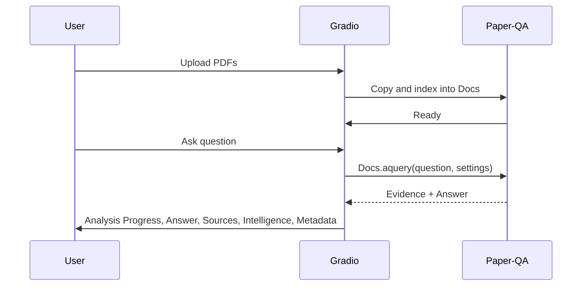

# Paper-QA UI: Developer Notes

This document records the current implementation precisely. It is a reference for maintainers.

## 1. Launch and environment
- Start UI: `make ui`
- Python 3.11+
- Default local stack uses Ollama for LLM and embeddings
- Optional providers via OpenRouter (or others) if configured in `configs/*.json` and environment

## 2. Execution model and threading
- A dedicated asyncio event loop runs in a background thread for all LLM/embedding I/O
- All Paper-QA async calls (`Docs.aadd`, `Docs.aget_evidence`, `Docs.aquery`) are scheduled via `asyncio.run_coroutine_threadsafe`
- The UI holds a single-query lock to avoid client contention

## 3. Query path
- Intake: uploads -> copy to `./papers` -> immediate in-memory indexing via `Docs.aadd`
- Query: `Docs.aquery(question, settings)` against in-memory `Docs`
- Settings are (re-)initialized per config change; defaults set research-oriented values

## 4. Files
- `src/ui/paperqa2_ui.py`: main UI
- `src/config_manager.py`: load JSON configs; returns Paper-QA `Settings`
- `README.md`, `DEVELOPER.md`: user guide and technical notes
- `TODO.md`: roadmap

## 5. Settings mutation
- On init, we apply the following defaults:
  - `answer.evidence_relevance_score_cutoff = 0`
  - `answer.evidence_k >= 15`
  - `answer.answer_max_sources >= 10`
  - `answer.get_evidence_if_no_contexts = True`
  - `answer.group_contexts_by_question = True`
  - `answer.answer_filter_extra_background = True`
  - Concurrency limited for Ollama (`max_concurrent_requests = 1`) for stability
  - Agent-side defaults to enable pre-search and return metadata

## 6. Query rewrite (advanced)
- Function: `llm_decompose_query(question: str, settings: Settings) -> Dict[str, Any]`
  - Invokes configured LLM via litellm (provider decided by config). Uses background loop
  - Returns `{ rewritten: str, filters: { years: [int, int] | null, venues: string[], fields: string[] } }`
  - Robust JSON capture: trims code fences, attempts substring extraction, and falls back to `{ rewritten: question, filters: {} }`
- UI flags
  - `use_llm_rewrite`: if True, call `llm_decompose_query`
  - `bias_retrieval`: if True, append a textual filter hint to the rewritten string
- State and export
  - `app_state["rewrite_info"] = { original, rewritten, filters, bias_applied?, augmented? }`
  - The `rewrite` object is copied into the session export JSON

## 7. Evidence curation
- Inputs:
  - `score_cutoff` (float) -> `answer.evidence_relevance_score_cutoff`
  - `max_sources` (int > 0) -> `answer.answer_max_sources`
  - `per_doc_cap` (int > 0) -> post-selection pruning per source
- State and export
  - `app_state["curation"] = { per_doc_cap, score_cutoff, max_sources }` 
  - The `curation` object is copied into the session export JSON

## 8. Display toggles
- `app_state["ui_toggles"] = { show_flags: bool, show_conflicts: bool }`
- Flags toggle controls rendering of source badges in the Sources list
- Conflicts toggle controls visibility of the clustered conflicts list

## 9. Research Intelligence
- Contradictions: heuristic antonym detection across sources
- Polarity clusters: naive verb→polarity mapping, sentence segmentation, and entity keying; groups mixed polarity across documents
- Conflicts UI: lists entity, number of sources, truncated source list; click-through expansion is a next step
- Diversity/recency: publication year histogram inferred from citations; preprint fraction
- Quality flags: `Preprint` and `Retracted?` based on title/citation heuristics

## 10. MMR visualization
- Selected set: diversity share and score histogram
- Candidate overlay: parsed heuristically from retrieval logs (temporary) and streamed as `mmr_candidates`; selected as `mmr`
- Transparency panel also shows `candidate_count` and `mmr_lambda` if present in logs

## 11. UI structure (mermaid)

### 11.1 System
```mermaid
flowchart LR
  subgraph UI
    A[Gradio Blocks]
    B[Upload]
    C[Question]
    D[Panels]
  end
  subgraph Engine
    E[Docs (Paper-QA)]
    F[Settings]
  end
  subgraph IO
    G[LLM Provider]
    H[Embeddings]
  end

  A --> E
  B --> E
  C --> E
  A --> F
  E --> G
  E --> H
```

### 11.2 In-UI Flow


## 12. Error handling
- Connection errors (Ollama/API): retry with exponential backoff inside `process_question_async`
- Loop-close issues: litellm reload guarded; all async on a single loop thread
- UI catches exceptions and prints a visible error

## 13. Testing and CI
- Local make target: `make test` runs ruff format, ruff check, and mypy
- CLI smoke tests available via `make test-cli` and `make cli-example`

## 14. Security and privacy
- Default is local-first with no external metadata calls
- External LLMs only when user opts into cloud configs

## 15. Roadmap
- Hook-based MMR candidate capture to replace log parsing
- Conflicts drill-down (click to expand excerpts)
- Per-source quality indicators from structured metadata if available
