# Paper-QA UI: Developer Documentation

## Table of Contents

1. [System Overview](#system-overview)
2. [Architecture & Data Flow](#architecture--data-flow)
3. [User Requirements Traceability](#user-requirements-traceability)
4. [Core Implementation](#core-implementation)
5. [Configuration System](#configuration-system)
6. [UI Architecture](#ui-architecture)
7. [Query Processing Pipeline](#query-processing-pipeline)
8. [Evidence & Intelligence System](#evidence--intelligence-system)
9. [Performance & Optimization](#performance--optimization)
10. [Development Workflow](#development-workflow)
11. [Roadmap & Future Development](#roadmap--future-development)

---

## System Overview

Paper-QA UI is a sophisticated web interface that transforms the [Paper-QA](https://github.com/Future-House/paper-qa) library into an intuitive, research-focused application. It provides high-accuracy Retrieval Augmented Generation (RAG) capabilities for scientific document analysis with real-time transparency and comprehensive evidence curation.
---

## Architecture & Data Flow

### High-Level System Architecture

```mermaid
flowchart TD
    %% User Interface Layer
    UPLOAD[📁 Upload PDFs]
    QUERY[❓ Ask Question]
    
    %% Processing Pipeline
    INDEX[📚 Index Documents]
    SEARCH[🔍 Retrieve Evidence]
    ANSWER[💡 Generate Answer]
    INTELL[🧠 Analyze Intelligence]
    
    %% Results Display
    DISPLAY[📊 View Results]
    
    %% Data Storage (Side Components)
    CORPUS[📖 Document Corpus]
    VECTORS[🔢 Vector Embeddings]
    METADATA[📋 Document Metadata]
    
    %% External Services (Side Components)
    LLM[🤖 LLM Services]
    EMB[🔤 Embedding Services]
    
    %% Primary Vertical Flow
    UPLOAD ==> INDEX
    QUERY ==> SEARCH
    INDEX ==> SEARCH
    SEARCH ==> ANSWER
    ANSWER ==> INTELL
    INTELL ==> DISPLAY
    
    %% Data Connections (Side arrows)
    INDEX -.-> CORPUS
    INDEX -.-> METADATA
    SEARCH -.-> VECTORS
    
    %% Service Connections (Side arrows)
    INDEX -.-> LLM
    SEARCH -.-> EMB
    ANSWER -.-> LLM
    
    %% Styling
    classDef uiStyle fill:#1e3a8a,stroke:#60a5fa,stroke-width:2px,color:#ffffff
    classDef procStyle fill:#581c87,stroke:#a855f7,stroke-width:2px,color:#ffffff
    classDef dataStyle fill:#166534,stroke:#4ade80,stroke-width:2px,color:#ffffff
    classDef extStyle fill:#ea580c,stroke:#fb923c,stroke-width:2px,color:#ffffff
    
    class UPLOAD,QUERY,DISPLAY uiStyle
    class INDEX,SEARCH,ANSWER,INTELL procStyle
    class CORPUS,VECTORS,METADATA dataStyle
    class LLM,EMB extStyle
```

### End-to-End Data Flow

```mermaid
sequenceDiagram
    participant U as 👤 User
    participant UI as 🖥️ Gradio UI
    participant AS as ⚡ AsyncIO Loop
    participant PQ as 🧠 Paper-QA
    participant LLM as 🤖 LLM Service
    participant EMB as 🔤 Embedding Service
    
    Note over U,EMB: 📄 Document Upload Phase
    U->>UI: Upload PDFs
    UI->>AS: process_uploaded_files_async()
    AS->>PQ: Docs.aadd()
    PQ->>EMB: Generate embeddings
    EMB-->>PQ: Vector representations
    PQ-->>AS: Indexed documents
    AS-->>UI: Upload complete
    
    Note over U,EMB: ❓ Question Processing Phase
    U->>UI: Enter question
    U->>UI: Click "Ask Question"
    UI->>AS: process_question_async()
    AS->>PQ: llm_decompose_query()
    PQ->>LLM: Query rewrite request
    LLM-->>PQ: Rewritten query + filters
    
    Note over U,EMB: 🔍 Evidence Retrieval Phase
    AS->>PQ: Docs.aquery()
    PQ->>EMB: Retrieve relevant chunks
    EMB-->>PQ: Evidence contexts
    PQ->>LLM: Generate answer
    LLM-->>PQ: Formatted answer
    
    Note over U,EMB: 🧠 Intelligence Analysis Phase
    AS->>PQ: Build intelligence analysis
    PQ-->>AS: Complete response
    AS-->>UI: Update UI components
    UI-->>U: Display results
```

## User Requirements Traceability

This section maps user requirements from the README to functional and system requirements, down to specific function calls.

### Traceability Matrix

| User Requirement (README Section) | Functional Requirement | System Requirement | Implementation Location | Key Functions |
|-----------------------------------|------------------------|-------------------|-------------------------|---------------|
| **Section 1: Document Intake** | Upload and index PDFs | File processing pipeline | `src/ui/paperqa2_ui.py` | `process_uploaded_files_async()` |
| | | Duplicate detection | `src/ui/paperqa2_ui.py` | `_copy_file_with_hash()` |
| | | Status tracking | `src/ui/paperqa2_ui.py` | `_update_upload_status()` |
| **Section 2: Configuration** | LLM/embedding config | JSON-based config system | `src/config_manager.py` | `load_config()` |
| | Query rewriting | LLM-based optimization | `src/ui/prompts.py` | `llm_decompose_query()` |
| | Evidence curation | Score-based filtering | `src/ui/paperqa2_ui.py` | `build_evidence_meta_summary_html()` |
| **Section 3: Tab Structure** | Plan & Retrieval | Question processing | `src/ui/paperqa2_ui.py` | `ask_with_progress()` |
| | Evidence display | Context visualization | `src/ui/paperqa2_ui.py` | `build_top_evidence_html()` |
| | Conflicts analysis | Quality assessment | `src/ui/paperqa2_ui.py` | `build_conflicts_html()` |
| | Research Intel | Intelligence generation | `src/ui/paperqa2_ui.py` | `build_intelligence_html()` |
| | Answer display | Response formatting | `src/ui/paperqa2_ui.py` | `format_answer_html()` |
| **Section 4: Default Behaviors** | Smart filter biasing | Filter enhancement | `src/ui/paperqa2_ui.py` | `_enhance_query_with_filters()` |
| | Quote extraction | Evidence traceability | `src/ui/paperqa2_ui.py` | `_extract_quotes()` |
| **Section 5: Operational Constraints** | Single query lock | Concurrency control | `src/ui/paperqa2_ui.py` | `_query_lock` |
| | Local-first processing | Resource management | `src/ui/paperqa2_ui.py` | `initialize_settings()` |


### Key Implementation Patterns

#### 1. Async Processing Pattern

```python
# Pattern: Background async execution with UI updates
async def process_question_async(question: str, config_name: str) -> Tuple[...]:
    """Main processing function with comprehensive error handling."""
    try:
        # Initialize settings
        settings = initialize_settings(config_name)
        
        # Query rewriting
        rewrite_result = await llm_decompose_query(question, settings)
        
        # Execute Paper-QA query
        answer = await docs.aquery(rewrite_result["rewritten"], settings)
        
        # Build response components
        evidence_html = build_evidence_meta_summary_html(answer.contexts)
        intelligence_html = build_intelligence_html(answer)
        
        return (answer.answer, evidence_html, intelligence_html, ...)
    except Exception as e:
        logger.error(f"Processing failed: {e}", exc_info=True)
        return error_response()
```

#### 2. UI Component Pattern

```python
# Pattern: Reusable UI components with state management
def create_evidence_display() -> gr.HTML:
    """Create evidence display component with dynamic updates."""
    return gr.HTML(
        value="<div class='pqa-panel'>Evidence will appear here...</div>",
        elem_classes=["pqa-evidence-panel"],
        interactive=False
    )

def update_evidence_display(contexts: List, score_cutoff: float) -> str:
    """Update evidence display with new data."""
    return build_evidence_meta_summary_html(contexts, score_cutoff)
```

#### 3. Configuration Pattern

```python
# Pattern: Centralized configuration management
def initialize_settings(config_name: str = "optimized_ollama") -> Settings:
    """Load and validate configuration with research defaults."""
    config = load_config(config_name)
    settings = config_to_settings(config)
    
    # Apply research-oriented defaults
    settings.answer.evidence_k = 15
    settings.answer.answer_max_sources = 10
    settings.answer.get_evidence_if_no_contexts = True
    
    return settings
```

---

## Configuration System

### Configuration Architecture

```mermaid
flowchart LR
    %% Sources
    JSON[📄 JSON Config]
    ENV[🔧 Env Vars]
    DEF[⚙️ Defaults]
    
    %% Processing Pipeline
    LOAD[📥 Load]
    VAL[✅ Validate]
    CONV[🔄 Convert]
    MERGE[🔗 Merge]
    
    %% Output
    SETTINGS[⚙️ Settings]
    UI[🖥️ UI Config]
    RUNTIME[🚀 Runtime]
    
    %% Flow
    JSON ==> LOAD
    ENV ==> LOAD
    DEF ==> MERGE
    
    LOAD ==> VAL
    VAL ==> CONV
    CONV ==> MERGE
    
    MERGE ==> SETTINGS
    MERGE ==> UI
    MERGE ==> RUNTIME
    
    %% Styling
    classDef sourceStyle fill:#166534,stroke:#4ade80,stroke-width:2px,color:#ffffff
    classDef processStyle fill:#581c87,stroke:#a855f7,stroke-width:2px,color:#ffffff
    classDef outputStyle fill:#1e3a8a,stroke:#60a5fa,stroke-width:2px,color:#ffffff
    
    class JSON,ENV,DEF sourceStyle
    class LOAD,VAL,CONV,MERGE processStyle
    class SETTINGS,UI,RUNTIME outputStyle
```

### Configuration Profiles

#### Optimized Ollama (Default)

```json
{
  "llm": "ollama/llama3.2",
  "embedding": "ollama/nomic-embed-text",
  "answer": {
    "evidence_k": 15,
    "answer_max_sources": 10,
    "max_concurrent_requests": 2,
    "get_evidence_if_no_contexts": true,
    "group_contexts_by_question": true,
    "answer_filter_extra_background": true
  },
  "temperature": 0.2
}
```

#### OpenRouter Integration

```json
{
  "llm": "openrouter/anthropic/claude-3.5-sonnet",
  "embedding": "ollama/nomic-embed-text",
  "llm_config": {
    "api_key": "${OPENROUTER_API_KEY}",
    "base_url": "https://openrouter.ai/api/v1"
  }
}
```

### Configuration Validation

```mermaid
flowchart LR
    %% Validation Pipeline
    V1[📋 Schema Validation]
    V2[✅ Required Fields]
    V3[📊 Value Ranges]
    V4[🔗 Dependencies]
    
    %% Results
    SUCCESS[✅ Valid Config]
    ERROR[❌ Validation Error]
    WARNING[⚠️ Warning]
    
    %% Flow
    V1 ==> V2
    V2 ==> V3
    V3 ==> V4
    
    V4 ==> SUCCESS
    V4 ==> ERROR
    V4 ==> WARNING
    
    %% Styling
    classDef validationStyle fill:#581c87,stroke:#a855f7,stroke-width:2px,color:#ffffff
    classDef successStyle fill:#166534,stroke:#4ade80,stroke-width:2px,color:#ffffff
    classDef errorStyle fill:#dc2626,stroke:#f87171,stroke-width:2px,color:#ffffff
    classDef warningStyle fill:#ea580c,stroke:#fb923c,stroke-width:2px,color:#ffffff
    
    class V1,V2,V3,V4 validationStyle
    class SUCCESS successStyle
    class ERROR errorStyle
    class WARNING warningStyle
```

---

## UI Architecture

### UI Component Hierarchy

```mermaid
flowchart TD
    %% Main Interface
    MAIN[🖥️ Gradio Interface]
    
    %% Left Panel Components
    UPLOAD[📁 Document Upload]
    CONFIG[⚙️ Configuration]
    CONTROLS[🎛️ Query Controls]
    EXPORT[💾 Export Options]
    
    %% Center Panel - Tab Container
    TABS[📋 Tab Container]
    
    %% Tab 1: Plan & Retrieval
    QUESTION[❓ Question Input]
    REWRITE[✏️ Rewrite Button]
    PROGRESS[📊 Analysis Progress]
    
    %% Tab 2: Evidence
    SUMMARY[📈 Evidence Summary]
    FACETS[🏷️ Facets Panel]
    SOURCES[📄 Evidence Sources]
    TOP_EVIDENCE[⭐ Top Evidence]
    
    %% Tab 3: Conflicts
    QUALITY[🔍 Quality Issues]
    CONFLICTS[⚠️ Relevance Conflicts]
    INSIGHTS[💡 Key Insights]
    
    %% Tab 4: Research Intel
    CONTRADICTIONS[🔀 Potential Contradictions]
    FLAGS[🚩 Quality Flags]
    DIVERSITY[📊 Diversity & Recency]
    CRITIQUE[📝 Critique]
    
    %% Tab 5: Answer
    ANSWER_DISPLAY[📋 Answer Display]
    
    %% Right Panel
    LIVE_PROGRESS[⚡ Live Analysis Progress]
    
    %% Main Structure
    MAIN ==> UPLOAD
    MAIN ==> CONFIG
    MAIN ==> CONTROLS
    MAIN ==> EXPORT
    MAIN ==> TABS
    MAIN ==> LIVE_PROGRESS
    
    %% Tab Content
    TABS ==> QUESTION
    TABS ==> REWRITE
    TABS ==> PROGRESS
    
    TABS ==> SUMMARY
    TABS ==> FACETS
    TABS ==> SOURCES
    TABS ==> TOP_EVIDENCE
    
    TABS ==> QUALITY
    TABS ==> CONFLICTS
    TABS ==> INSIGHTS
    
    TABS ==> CONTRADICTIONS
    TABS ==> FLAGS
    TABS ==> DIVERSITY
    TABS ==> CRITIQUE
    
    TABS ==> ANSWER_DISPLAY
    
    %% Styling
    classDef mainStyle fill:#1e3a8a,stroke:#60a5fa,stroke-width:3px,color:#ffffff
    classDef leftPanelStyle fill:#166534,stroke:#4ade80,stroke-width:2px,color:#ffffff
    classDef tabStyle fill:#581c87,stroke:#a855f7,stroke-width:2px,color:#ffffff
    classDef contentStyle fill:#ea580c,stroke:#fb923c,stroke-width:2px,color:#ffffff
    classDef rightPanelStyle fill:#dc2626,stroke:#f87171,stroke-width:2px,color:#ffffff
    
    class MAIN mainStyle
    class UPLOAD,CONFIG,CONTROLS,EXPORT leftPanelStyle
    class TABS tabStyle
    class QUESTION,REWRITE,PROGRESS,SUMMARY,FACETS,SOURCES,TOP_EVIDENCE,QUALITY,CONFLICTS,INSIGHTS,CONTRADICTIONS,FLAGS,DIVERSITY,CRITIQUE,ANSWER_DISPLAY contentStyle
    class LIVE_PROGRESS rightPanelStyle
```

### UI State Management

```mermaid
flowchart LR
    %% State Storage
    STATE_QUESTION[❓ Question State]
    STATE_PROGRESS[📊 Progress State]
    STATE_RESULTS[📋 Results State]
    STATE_CONFIG[⚙️ Config State]
    
    %% State Updates
    UPDATE_QUESTION[🔄 Question Change]
    UPDATE_PROGRESS[⚡ Progress Update]
    UPDATE_RESULTS[✅ Results Ready]
    UPDATE_CONFIG[🔧 Config Change]
    
    %% UI Components
    COMP_QUESTION[💬 Question Input]
    COMP_PROGRESS[📈 Progress Display]
    COMP_RESULTS[📊 Results Display]
    COMP_CONFIG[🎛️ Config Panel]
    
    %% Flow
    STATE_QUESTION ==> UPDATE_QUESTION
    STATE_PROGRESS ==> UPDATE_PROGRESS
    STATE_RESULTS ==> UPDATE_RESULTS
    STATE_CONFIG ==> UPDATE_CONFIG
    
    UPDATE_QUESTION ==> COMP_QUESTION
    UPDATE_PROGRESS ==> COMP_PROGRESS
    UPDATE_RESULTS ==> COMP_RESULTS
    UPDATE_CONFIG ==> COMP_CONFIG
    
    %% Styling
    classDef stateStyle fill:#1e3a8a,stroke:#60a5fa,stroke-width:2px,color:#ffffff
    classDef updateStyle fill:#581c87,stroke:#a855f7,stroke-width:2px,color:#ffffff
    classDef componentStyle fill:#166534,stroke:#4ade80,stroke-width:2px,color:#ffffff
    
    class STATE_QUESTION,STATE_PROGRESS,STATE_RESULTS,STATE_CONFIG stateStyle
    class UPDATE_QUESTION,UPDATE_PROGRESS,UPDATE_RESULTS,UPDATE_CONFIG updateStyle
    class COMP_QUESTION,COMP_PROGRESS,COMP_RESULTS,COMP_CONFIG componentStyle
```

### Event Flow Architecture

```mermaid
sequenceDiagram
    participant U as 👤 User
    participant UI as 🖥️ UI Components
    participant EH as ⚡ Event Handlers
    participant AS as 🔄 AsyncIO Loop
    participant PQ as 🧠 Paper-QA
    
    Note over U,PQ: 🎯 User Interaction Flow
    U->>UI: Interact with component
    UI->>EH: Trigger event
    
    Note over U,PQ: ⚡ Async Processing
    EH->>AS: Schedule async task
    AS->>PQ: Execute operation
    PQ-->>AS: Return result
    
    Note over U,PQ: 🔄 UI Update Cycle
    AS->>EH: Update callback
    EH->>UI: Update component
    UI-->>U: Display result
```

---

## Query Processing Pipeline

### Query Processing Flow

```mermaid
flowchart TD
    %% Input Processing
    QUESTION[❓ User Question]
    CONFIG[⚙️ Configuration]
    CONTEXT_IN[📋 Session Context]
    
    %% Query Rewriting
    REWRITE[🤖 LLM Rewrite]
    FILTERS[🏷️ Filter Extraction]
    ENHANCE[✨ Query Enhancement]
    
    %% Document Retrieval
    SEARCH[🔍 Vector Search]
    MMR[🎯 MMR Selection]
    RANK[📊 Relevance Ranking]
    
    %% Answer Generation
    CONTEXT_ASM[🔧 Context Assembly]
    LLM_CALL[🧠 LLM Generation]
    FORMAT[📝 Response Formatting]
    
    %% Intelligence Analysis
    CONTRADICTIONS[🔀 Contradiction Detection]
    QUALITY[🔍 Quality Assessment]
    DIVERSITY[📊 Diversity Analysis]
    CRITIQUE[📝 Critique Generation]
    
    %% Flow
    QUESTION ==> REWRITE
    CONFIG ==> REWRITE
    CONTEXT_IN ==> REWRITE
    
    REWRITE ==> FILTERS
    FILTERS ==> ENHANCE
    ENHANCE ==> SEARCH
    
    SEARCH ==> MMR
    MMR ==> RANK
    RANK ==> CONTEXT_ASM
    
    CONTEXT_ASM ==> LLM_CALL
    LLM_CALL ==> FORMAT
    FORMAT ==> CONTRADICTIONS
    
    CONTRADICTIONS ==> QUALITY
    QUALITY ==> DIVERSITY
    DIVERSITY ==> CRITIQUE
    
    %% Styling
    classDef inputStyle fill:#1e3a8a,stroke:#60a5fa,stroke-width:2px,color:#ffffff
    classDef rewriteStyle fill:#581c87,stroke:#a855f7,stroke-width:2px,color:#ffffff
    classDef retrievalStyle fill:#166534,stroke:#4ade80,stroke-width:2px,color:#ffffff
    classDef answerStyle fill:#ea580c,stroke:#fb923c,stroke-width:2px,color:#ffffff
    classDef intelligenceStyle fill:#dc2626,stroke:#f87171,stroke-width:2px,color:#ffffff
    
    class QUESTION,CONFIG,CONTEXT_IN inputStyle
    class REWRITE,FILTERS,ENHANCE rewriteStyle
    class SEARCH,MMR,RANK retrievalStyle
    class CONTEXT_ASM,LLM_CALL,FORMAT answerStyle
    class CONTRADICTIONS,QUALITY,DIVERSITY,CRITIQUE intelligenceStyle
```

### Query Rewriting System

```mermaid
flowchart LR
    %% Input
    USER_Q[❓ User Question]
    SETTINGS[⚙️ LLM Settings]
    
    %% Processing Pipeline
    PROMPT[📝 Prompt Assembly]
    LLM_CALL[🤖 LLM Call]
    PARSE[🔍 Response Parsing]
    VALIDATE[✅ Validation]
    
    %% Output
    REWRITTEN[✏️ Rewritten Query]
    FILTERS[🏷️ Extracted Filters]
    ENHANCED[✨ Enhanced Query]
    
    %% Flow
    USER_Q ==> PROMPT
    SETTINGS ==> PROMPT
    PROMPT ==> LLM_CALL
    LLM_CALL ==> PARSE
    PARSE ==> VALIDATE
    VALIDATE ==> REWRITTEN
    VALIDATE ==> FILTERS
    REWRITTEN ==> ENHANCED
    FILTERS ==> ENHANCED
    
    %% Styling
    classDef inputStyle fill:#1e3a8a,stroke:#60a5fa,stroke-width:2px,color:#ffffff
    classDef processStyle fill:#581c87,stroke:#a855f7,stroke-width:2px,color:#ffffff
    classDef outputStyle fill:#166534,stroke:#4ade80,stroke-width:2px,color:#ffffff
    
    class USER_Q,SETTINGS inputStyle
    class PROMPT,LLM_CALL,PARSE,VALIDATE processStyle
    class REWRITTEN,FILTERS,ENHANCED outputStyle
```

### Evidence Retrieval System

```mermaid
flowchart TD
    %% Input Query
    ENHANCED_Q[✨ Enhanced Query]
    CORPUS[📖 Document Corpus]
    
    %% Retrieval Pipeline
    EMBED[🔢 Query Embedding]
    SIMILARITY[🔍 Similarity Search]
    CANDIDATES[📝 Candidate Selection]
    
    %% Selection Algorithm
    MMR[🎯 MMR Algorithm]
    DIVERSITY[📊 Diversity Scoring]
    RELEVANCE[✅ Relevance Filtering]
    
    %% Output Results
    EVIDENCE[📄 Selected Evidence]
    METADATA[📋 Evidence Metadata]
    SCORES[📈 Relevance Scores]
    
    %% Flow
    ENHANCED_Q ==> EMBED
    CORPUS ==> EMBED
    EMBED ==> SIMILARITY
    SIMILARITY ==> CANDIDATES
    CANDIDATES ==> MMR
    MMR ==> DIVERSITY
    DIVERSITY ==> RELEVANCE
    RELEVANCE ==> EVIDENCE
    RELEVANCE ==> METADATA
    RELEVANCE ==> SCORES
    
    %% Styling
    classDef queryStyle fill:#1e3a8a,stroke:#60a5fa,stroke-width:2px,color:#ffffff
    classDef retrievalStyle fill:#581c87,stroke:#a855f7,stroke-width:2px,color:#ffffff
    classDef selectionStyle fill:#166534,stroke:#4ade80,stroke-width:2px,color:#ffffff
    classDef outputStyle fill:#ea580c,stroke:#fb923c,stroke-width:2px,color:#ffffff
    
    class ENHANCED_Q,CORPUS queryStyle
    class EMBED,SIMILARITY,CANDIDATES retrievalStyle
    class MMR,DIVERSITY,RELEVANCE selectionStyle
    class EVIDENCE,METADATA,SCORES outputStyle
```

---

## Evidence & Intelligence System

### Evidence Processing Pipeline

```mermaid
flowchart TD
    %% Evidence Input
    CONTEXTS[📄 Retrieved Contexts]
    METADATA[📋 Document Metadata]
    SCORES[📈 Relevance Scores]
    
    %% Processing Pipeline
    FILTER[🔍 Score Filtering]
    GROUP[📊 Source Grouping]
    RANK[📈 Relevance Ranking]
    DIVERSIFY[🎯 Diversity Analysis]
    
    %% Evidence Output
    SUMMARY[📊 Evidence Summary]
    TOP_EVIDENCE[⭐ Top Evidence]
    FACETS[🏷️ Evidence Facets]
    CONFLICTS[⚠️ Evidence Conflicts]
    
    %% Flow
    CONTEXTS ==> FILTER
    METADATA ==> GROUP
    SCORES ==> RANK
    
    FILTER ==> GROUP
    GROUP ==> RANK
    RANK ==> DIVERSIFY
    
    DIVERSIFY ==> SUMMARY
    DIVERSIFY ==> TOP_EVIDENCE
    DIVERSIFY ==> FACETS
    DIVERSIFY ==> CONFLICTS
    
    %% Styling
    classDef inputStyle fill:#1e3a8a,stroke:#60a5fa,stroke-width:2px,color:#ffffff
    classDef processStyle fill:#581c87,stroke:#a855f7,stroke-width:2px,color:#ffffff
    classDef outputStyle fill:#166534,stroke:#4ade80,stroke-width:2px,color:#ffffff
    
    class CONTEXTS,METADATA,SCORES inputStyle
    class FILTER,GROUP,RANK,DIVERSIFY processStyle
    class SUMMARY,TOP_EVIDENCE,FACETS,CONFLICTS outputStyle
```

### Intelligence Analysis System

```mermaid
flowchart LR
    %% Input Data
    ANSWER[💡 Generated Answer]
    EVIDENCE[📄 Evidence Contexts]
    METADATA[📋 Document Metadata]
    
    %% Analysis Components
    CONTRADICTIONS[🔀 Contradiction Detection]
    QUALITY[🔍 Quality Assessment]
    DIVERSITY[📊 Diversity Analysis]
    CRITIQUE[📝 Critique Generation]
    
    %% Output Intelligence
    CONTRADICTIONS_OUT[⚠️ Potential Contradictions]
    QUALITY_FLAGS[🚩 Quality Flags]
    DIVERSITY_METRICS[📈 Diversity Metrics]
    CRITIQUE_TEXT[📝 Critique Text]
    
    %% Flow
    ANSWER ==> CONTRADICTIONS
    EVIDENCE ==> CONTRADICTIONS
    METADATA ==> QUALITY
    
    ANSWER ==> QUALITY
    EVIDENCE ==> DIVERSITY
    METADATA ==> DIVERSITY
    
    ANSWER ==> CRITIQUE
    EVIDENCE ==> CRITIQUE
    
    CONTRADICTIONS ==> CONTRADICTIONS_OUT
    QUALITY ==> QUALITY_FLAGS
    DIVERSITY ==> DIVERSITY_METRICS
    CRITIQUE ==> CRITIQUE_TEXT
    
    %% Styling
    classDef inputStyle fill:#1e3a8a,stroke:#60a5fa,stroke-width:2px,color:#ffffff
    classDef analysisStyle fill:#581c87,stroke:#a855f7,stroke-width:2px,color:#ffffff
    classDef outputStyle fill:#166534,stroke:#4ade80,stroke-width:2px,color:#ffffff
    
    class ANSWER,EVIDENCE,METADATA inputStyle
    class CONTRADICTIONS,QUALITY,DIVERSITY,CRITIQUE analysisStyle
    class CONTRADICTIONS_OUT,QUALITY_FLAGS,DIVERSITY_METRICS,CRITIQUE_TEXT outputStyle
```

### Contradiction Detection Algorithm

```mermaid
flowchart TD
    %% Input Processing
    DOCUMENTS[📚 Document Collection]
    ENTITIES[🏷️ Entity Extraction]
    POLARITY[🎯 Polarity Analysis]
    
    %% Detection Pipeline
    ANTONYM[🔀 Antonym Detection]
    CLUSTERING[📊 Entity Clustering]
    CONFLICT[⚠️ Conflict Identification]
    
    %% Output Generation
    CONTRADICTIONS[🔀 Contradiction Groups]
    SOURCES[📄 Source Mapping]
    CONFIDENCE[📈 Confidence Scores]
    
    %% Flow
    DOCUMENTS ==> ENTITIES
    ENTITIES ==> POLARITY
    POLARITY ==> ANTONYM
    
    ANTONYM ==> CLUSTERING
    CLUSTERING ==> CONFLICT
    CONFLICT ==> CONTRADICTIONS
    
    CONTRADICTIONS ==> SOURCES
    CONTRADICTIONS ==> CONFIDENCE
    
    %% Styling
    classDef inputStyle fill:#1e3a8a,stroke:#60a5fa,stroke-width:2px,color:#ffffff
    classDef detectionStyle fill:#581c87,stroke:#a855f7,stroke-width:2px,color:#ffffff
    classDef outputStyle fill:#166534,stroke:#4ade80,stroke-width:2px,color:#ffffff
    
    class DOCUMENTS,ENTITIES,POLARITY inputStyle
    class ANTONYM,CLUSTERING,CONFLICT detectionStyle
    class CONTRADICTIONS,SOURCES,CONFIDENCE outputStyle
```

---

## Performance & Optimization

### Performance Architecture


### Optimization Strategies

#### 1. Local Processing Optimizations

- **Ollama Integration**: Optimized for single-user local workloads
- **Concurrent Request Limiting**: `max_concurrent_requests = 2` for stability
- **Memory Management**: Efficient in-memory document indexing
- **Resource Cleanup**: Proper cleanup of temporary resources

#### 2. Evidence Retrieval Optimizations

- **MMR Search**: Maximum Marginal Relevance for diverse evidence selection
- **Relevance Scoring**: Multi-stage evidence ranking
- **Source Tracking**: Complete citation and provenance information
- **Caching**: Efficient vector storage and retrieval

#### 3. UI Performance Optimizations

- **Lazy Loading**: Components load only when needed
- **Incremental Updates**: UI updates without full re-renders
- **Background Processing**: Non-blocking operations
- **State Management**: Efficient state updates and propagation

### Performance Monitoring


---

## Development Workflow

### Development Environment Setup


### Testing Strategy


### Code Quality Pipeline


---

## Roadmap and Future Development

### Completed Features

- ✅ **Analysis Progress with live updates and transparency metrics**
  - Real-time progress tracking with chevron indicators
  - Comprehensive transparency metrics for evidence selection
  - Live updates during processing with user feedback

- ✅ **MMR visualization with candidate/selected comparison**
  - Maximum Marginal Relevance algorithm visualization
  - Candidate vs selected evidence comparison
  - Diversity metrics and selection transparency

- ✅ **Research Intelligence: contradictions, insights, evidence summary**
  - Cross-document contradiction detection
  - Evidence pattern analysis and insights
  - Comprehensive evidence summary with metadata

- ✅ **Source quality flags and reputation indicators**
  - Preprint detection and flagging
  - Retraction detection heuristics
  - Venue quality indicators

- ✅ **LLM-based query rewriting with filter extraction**
  - Intelligent query optimization
  - Filter extraction (years, venues, fields, species, study types, outcomes)
  - Smart filter biasing for enhanced retrieval

- ✅ **Evidence curation controls and preview**
  - Score-based evidence filtering
  - Real-time evidence preview
  - Curation controls with immediate feedback

- ✅ **Export functionality (JSON/CSV/JSONL/ZIP)**
  - Comprehensive session export
  - Multiple export formats
  - Trace data export for analysis

- ✅ **Comprehensive error handling and recovery**
  - Robust error handling throughout pipeline
  - Graceful degradation and recovery
  - User-friendly error messages

### High Priority Next Steps

#### Evidence Curation Enhancements

- **Real-time preview refinements**: Apply cutoff adjustments to histograms
  - Dynamic histogram updates based on score cutoff changes
  - Real-time evidence count updates
  - Interactive filtering with immediate visual feedback

- **Venue quality indicators**: Enhanced reputation scoring when metadata available
  - Journal impact factor integration
  - Conference ranking indicators
  - Source credibility scoring

- **Conflicts drill-down**: Expandable polarity-grouped excerpts
  - Detailed contradiction analysis
  - Source-specific conflict resolution
  - Evidence strength assessment

#### MMR Visualization Improvements

- **Hook-based candidate capture**: Replace log parsing with deterministic hooks
  - Direct integration with Paper-QA MMR algorithm
  - Real-time candidate selection tracking
  - Improved accuracy and performance

- **Enhanced diversity metrics**: More sophisticated diversity measurements
  - Semantic diversity scoring
  - Temporal diversity analysis
  - Source diversity optimization

- **Export integration**: Include candidate/selected sets in exports
  - MMR candidate data in exports
  - Selection rationale documentation
  - Comparison analysis tools

#### Live Analytics

- **Tool calls monitoring**: Real-time operation tracking
  - LLM call monitoring and optimization
  - Embedding operation tracking
  - Performance bottleneck identification

- **Performance dashboard**: Comprehensive metrics display
  - Real-time performance metrics
  - Resource utilization monitoring
  - Optimization recommendations

- **Pause/resume functionality**: Control over long-running operations
  - User-controlled processing interruption
  - State preservation during pauses
  - Graceful resumption capabilities

### Technical Debt and Improvements

#### Code Quality Enhancements

- **Async/await consistency**: Full migration to async patterns
  - Complete async/await implementation
  - Improved concurrency handling
  - Better error propagation

- **Type safety**: Enhanced type annotations throughout
  - Comprehensive type hints
  - Static type checking improvements
  - Better IDE support and error detection

- **Test coverage**: Comprehensive test suite expansion
  - Unit test coverage for all components
  - Integration test scenarios
  - Performance regression testing

#### Documentation and Maintenance

- **API documentation generation**: Automated API documentation
  - Function signature documentation
  - Parameter validation documentation
  - Usage examples and best practices

- **Performance profiling**: Systematic optimization opportunities
  - Performance bottleneck identification
  - Optimization strategy development
  - Resource utilization analysis

#### Architecture Improvements

- **Modular component design**: Enhanced component modularity
  - Reusable UI components
  - Plugin architecture for extensions
  - Configuration-driven customization

- **Scalability improvements**: Enhanced system scalability
  - Multi-user support considerations
  - Distributed processing capabilities
  - Resource scaling strategies

### Future Vision

#### Advanced Features

- **Collaborative analysis**: Multi-user research collaboration
  - Shared session management
  - Collaborative annotation
  - Team-based analysis workflows

- **Advanced analytics**: Enhanced research analytics
  - Trend analysis across documents
  - Citation network analysis
  - Research gap identification

- **Integration capabilities**: External system integration
  - Reference manager integration
  - Academic database connections
  - Publication workflow integration

#### Research Workflow Enhancements

- **Automated literature reviews**: Streamlined review processes
  - Systematic review automation
  - Meta-analysis support
  - Evidence synthesis tools

- **Research planning**: Enhanced research planning capabilities
  - Research question formulation
  - Methodology planning
  - Resource allocation optimization

---

## Conclusion

Paper-QA UI represents a sophisticated integration of modern web technologies with advanced natural language processing capabilities, specifically designed for scientific literature analysis. The architecture balances performance, usability, and extensibility while maintaining the rigor required for research applications.

### Key Achievements

1. **User-Centric Design**: Streamlined interface that reduces cognitive load while maintaining powerful functionality
2. **Research-First Approach**: Optimized for scientific workflows with comprehensive evidence analysis
3. **Transparency and Traceability**: Complete visibility into the analysis process with detailed evidence tracking
4. **Performance Optimization**: Efficient local-first architecture with cloud fallbacks
5. **Extensibility**: Modular design that supports future enhancements and customizations

### Technical Excellence

- **Robust Architecture**: Comprehensive error handling and recovery mechanisms
- **Performance Optimization**: Efficient processing pipeline with real-time updates
- **Code Quality**: High standards for maintainability and extensibility
- **Documentation**: Comprehensive technical documentation with traceability mapping

### Future Directions

The system is positioned for continued evolution with a clear roadmap for advanced features, performance improvements, and research workflow enhancements. The modular architecture ensures that new capabilities can be integrated seamlessly while maintaining the core principles of transparency, accuracy, and usability.

For additional support, contributions, or collaboration opportunities, please refer to the project repository and community resources. The development team welcomes feedback, suggestions, and contributions from the research community to further enhance the system's capabilities and impact.
