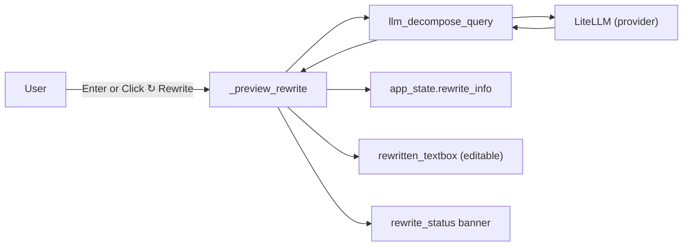
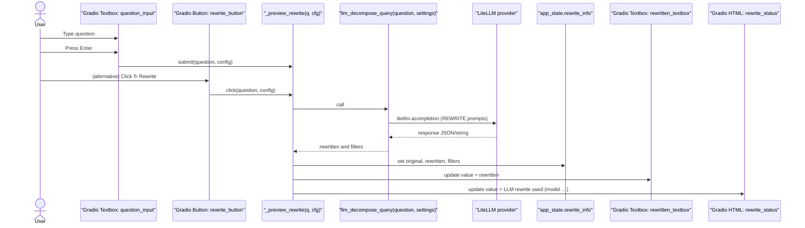
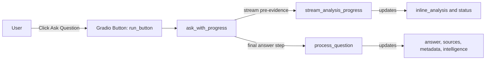
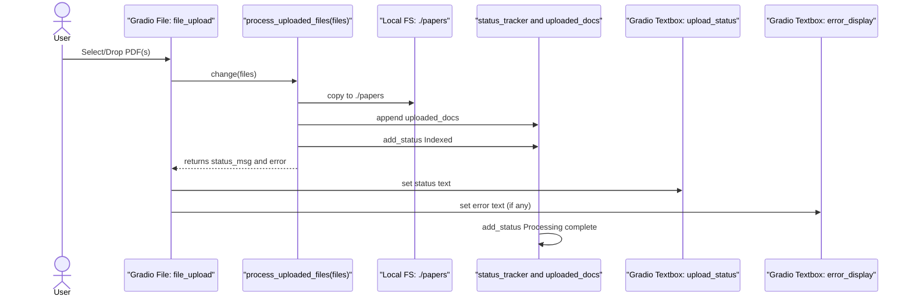
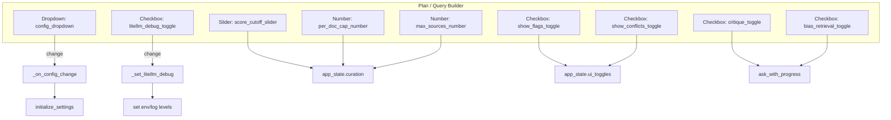

### Paper-QA UI Flows (User → UI → Functions)

This document summarizes how interactions in the Gradio UI map to functions in the codebase and external systems. Each Mermaid diagram shows a visual flow from user actions to the functions executed and any external calls.

Note: File/function names reference src/ui/paperqa2_ui.py unless otherwise noted.

### Rewrite (Plan tab)

User triggers rewrite via Enter in Question or clicking ↻ Rewrite.

Key points:
- No retrieval required; rewrite is question-only with REWRITE prompts.
- Logs include the full user prompt and raw response (truncated) for visibility.

### Ask Question (high-level, no internals yet)

Clicking "Ask Question" runs retrieval + synthesis. This is a high-level outline only.

Notes:
- The exact retrieval/synthesis internals will be documented in the next step.
- The final query used is whatever is in rewritten_textbox (editable) or the original if empty.

### Uploading PDF Documents

Selecting PDFs in the left rail triggers processing and indexing.

Notes:
- No auto-retrieval is triggered on completion.
- The right-rail Session Log mirrors status_tracker messages.

### Query Builder Options (Plan → affects later retrieval)

Changing configuration and curation toggles updates settings/state used by Ask.

Notes:
- config_dropdown initializes settings (provider/model); affects rewrite and Ask.
- litellm_debug_toggle sets LITELLM_LOG=DEBUG and raises logger levels.
- Curation controls (score_cutoff, per_doc_cap, max_sources) are stored in app_state.curation and applied inside ask_with_progress before retrieval.
- bias_retrieval_toggle only augments the query if rewrite toggles are enabled within ask_with_progress (currently default OFF).
- critique_toggle, show_flags_toggle, show_conflicts_toggle influence optional outputs/formatting in the Synthesis and Evidence displays.

### Components and Functions Reference

- UI components: question_input, rewrite_button, rewritten_textbox, run_button, file_upload, upload_status, inline_analysis, answer_display, sources_display, metadata_display, intelligence_display.
- Rewrite functions: _preview_rewrite(q, cfg), llm_decompose_query(question, settings), rewrite_query(question, settings) (heuristic fallback).
- Ask entrypoint: ask_with_progress (streams progress and final results). Internals will be covered next.
- Upload processing: process_uploaded_files_async/files(), status mirrored via status_tracker.
- Config/Debug: _on_config_change, _set_litellm_debug.

### Future (Next Step)
- Detail the internals for Ask Question: pre-evidence streaming (stream_analysis_progress, _run_pre_evidence_in_thread, Docs.aget_evidence callbacks) and final synthesis (process_question), with sequence diagrams and data structures.
