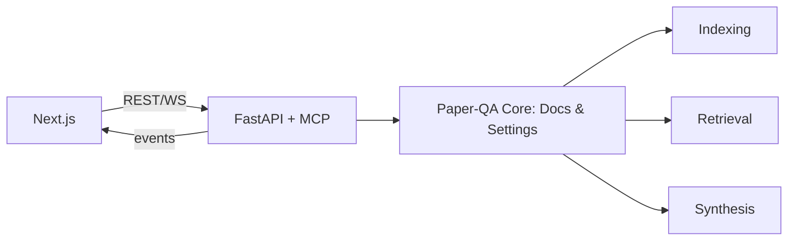

# UX Project Plan: React (Next.js) + FastAPI (MCP) Rewrite

This plan describes how to deliver a new MCP‑compliant backend with a React (Next.js) frontend while preserving the current Gradio app. The new project will live under `src/ux/` at the repository root (same level as `src/ui`). The goal is a phased, end‑to‑end flow aligned with data‑scientist workflows (see UX-strategy.md) and the roadmap (see TODO.md).

## 0. Objectives
- Keep `src/ui` (Gradio) intact; introduce a parallel `ux/` app.
- Re‑use Python core logic (Paper‑QA: indexing/query/curation) via a FastAPI service.
- Provide MCP (Model Context Protocol) endpoints so the backend is MCP‑compliant.
- Stream live progress/events to the frontend via WebSockets.
- Ship an end‑to‑end minimal flow first (Phase 1), then iterate.

## 1. Architecture overview
- Frontend: Next.js (React), TypeScript, component kit (Mantine or Material UI), charts (ECharts or Recharts), table (AG Grid).
- Backend: FastAPI + Starlette WebSockets + Pydantic schemas + Uvicorn.
- MCP: Implement an MCP server wrapper around FastAPI handlers (HTTP+WS) and expose request/response schemas.
- Events: Versioned JSON events (phase, stats, mmr, conflicts, logs, answer_stats) over WS.
- Persistence: In‑memory during dev; export via REST (JSON/CSV/JSONL/ZIP) mirroring current app.

### Data flow (high level)


## 2. Directory layout (new `ux/` project)
```
src/ux/
  backend/
    app.py                # FastAPI app + MCP adapter
    mcp_server.py         # MCP server entry (wrapping FastAPI handlers)
    schemas.py            # Pydantic models for requests/events/responses
    services/
      paperqa_service.py  # Thin layer reusing current code (Docs, Settings)
      rewrite_service.py  # LLM rewrite + heuristic fallback
      curation_service.py # cutoff/caps, hard-filter enforcement
      conflicts_service.py# polarity clustering helpers
    runtime/
      state.py            # in-memory session state (per-run)
  frontend/
    package.json
    next.config.js
    src/
      pages/
        index.tsx         # Entry: tabs shell
      components/
        Plan/
        Retrieval/
        Evidence/
        Conflicts/
        Synthesis/
        Shared/
      lib/
        api.ts            # REST client
        ws.ts             # WS hook
        models.ts         # TS interfaces mirroring schemas.py
```

## 3. Backend (FastAPI + MCP)

### 3.1 REST endpoints (Phase 1)
- POST `/api/rewrite` → {original} -> {rewritten, filters}
- POST `/api/run` → {question, settings, rewrite?, filters?, mode: bias|hard, curation} → 202 Accepted
- GET `/api/export/session.json` → latest session
- GET `/api/export/context.csv` → contexts CSV
- GET `/api/export/trace.jsonl` → event log
- GET `/api/export/bundle.zip` → bundle

### 3.2 WebSocket channel
- WS `/ws/events` → emits versioned events:
  - `phase` {phase: retrieval|summaries|answer, status: start|end}
  - `metric` {contexts_selected, elapsed_s}
  - `stats` {score_min, score_mean, score_max, per_doc, scores_list?}
  - `mmr` {items: [{doc, score}]}, `mmr_candidates` likewise
  - `answer_stats` {elapsed_s, sources_included, approx_prompt_chars, attempts}
  - `log` {data}
  - `answer` {markdown}

### 3.3 MCP compliance
- Wrap core actions as MCP tools:
  - `mcp.rewrite(question)` → rewritten + filters
  - `mcp.run(querySpec)` → start run; stream events
  - `mcp.export(kind)` → return export artifact
- Provide MCP manifest + schemas (JSON Schema) for requests/responses.

### 3.4 Reuse from current code
- Import and reuse current `initialize_settings`, `Docs.aadd/aquery`, rewrite logic, conflicts clustering, curation rules, and event structuring. Minimal adaptation into `services/`.

## 4. Frontend (Next.js)

### 4.1 Tabs and core views (Phase 1)
- Plan: Original vs Rewritten (editable), “Generate rewrite” button, Accept rewrite, filter chips (years/venues/fields) in Bias mode only; show Query Used.
- Retrieval: Scope chips, big progress bar (selected/evidence_k + ≥ cutoff), recent events; live MMR histogram (selected vs candidates).
- Evidence: Simple list of cards with title/citation, year/page/score, snippet; include/exclude; show flags.
- Conflicts: Basic clustered list by entity (no expansion yet).
- Synthesis: Answer (markdown) + critique list (normalized numbering), inline citations.

### 4.2 Types and wiring
- TS interfaces mirror Pydantic models for strict typing.
- A shared WS hook (`ws.ts`) subscribes to events; global state via Zustand.
- Each tab consumes only its slice of state (minimize re-renders; throttle charts).

## 5. Phased delivery (map to TODO + UX-strategy)

### Phase 1 (end-to-end minimal)
- Backend: REST `/rewrite`, `/run`, WS `/events`, basic exports.
- Frontend: Plan/Retrieval/Evidence/Synthesis tabs with minimal controls; Bias mode only; live progress, MMR overlay, critique.
- Export: rewrite, curation, toggles.

### Phase 2 (curation + conflicts)
- Hard filter mode enforcement on backend; UI switch.
- Evidence cards: per‑doc cap inline; venue line when metadata present.
- Conflicts tab: expandable items; polarity excerpts; minimal modal.
- Cutoff-aware histograms.

### Phase 3 (analytics + snapshots)
- Tool-calls table; pause/compact mode.
- Saved queries (rewrite + facets + curation + toggles) + diff.

### Phase 4 (MMR + exports polish)
- True MMR hooks; remove log parsing; export candidate/selected.
- Structured JSONL event types/timestamps; enriched JSON.

## 6. Make targets (scaffold)
Add prefixed targets to keep `ui` untouched.

- `make ux-setup` → create `ux/frontend` and `ux/backend` envs, install deps
- `make ux-dev` → run `uvicorn ux.backend.app:app --reload` and `next dev` concurrently (doc only; no long-lived commands invoked by CI)
- `make ux-test` → backend tests via pytest + mypy; frontend lint/typecheck via eslint/tsc
- `make ux-build` → `next build` and backend wheel or docker build
- `make ux-export` → call backend export endpoints into `exports/`

(Implementation in Makefile will follow after scaffolding.)

## 7. Risks & mitigations
- Streaming/state churn: throttle charts; only update deltas.
- MCP spec alignment: ship a stable manifest + JSON schemas; version events.
- Rewrite drift: always display and export Query Used.
- Metadata sparsity: venue line is opportunistic; hide when absent.

## 8. Acceptance for Phase 1
- End-to-end run: upload → rewrite (visible) → retrieval progress → evidence list → answer + critique → export.
- WS events render on Retrieval page; Ask button disabled during run; re-enabled when complete.
- Exports contain rewrite/curation/toggles and trace.
